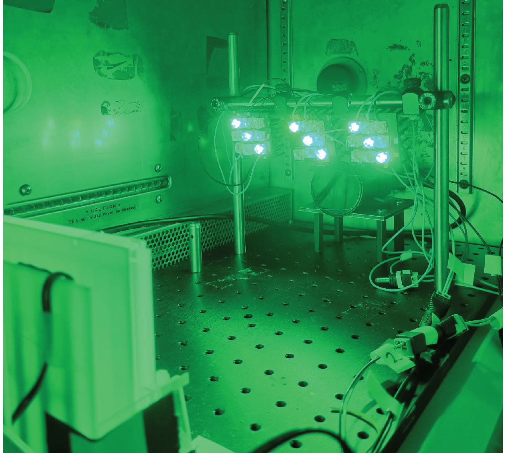

[Behavioral rigs]{.eyebrow}

Custom rigs, chambers, and CAD I design and build for behavioral experiments.

::::: {.card-grid}

:::: {.pcard}

::: {.pcard-body}
### [*C. elegans* behavioral tracking](hardware/celegans/index.qmd){.stretched-link}
[Optogenetics · custom rig · DeepLabCut]{.paper-meta}
:::

::::

:::: {.pcard}

::: {.pcard-body}
### [Climbing chamber](hardware/climbing/index.qmd){.stretched-link}
[Vertical assay · negative geotaxis]{.paper-meta}
:::

::::

:::::
