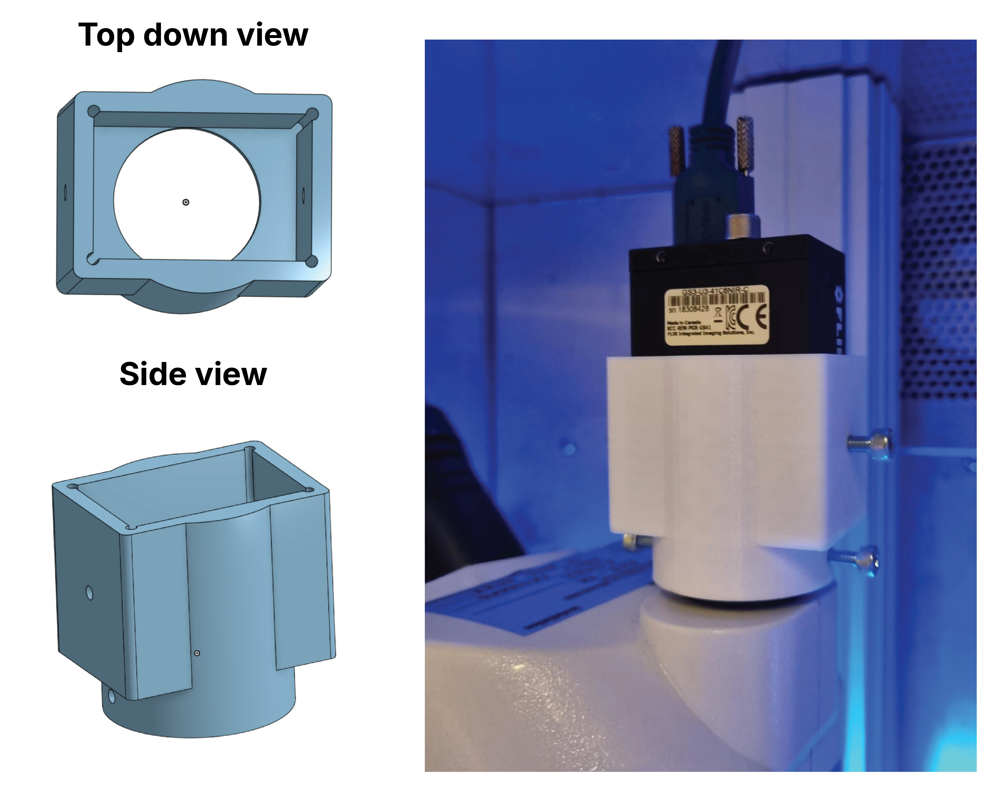

[← Back to hardware](../../hardware.qmd){.back-link}

This rig was built for the *C. elegans* arm of the [KCR silencing study](../../papers/kcr/index.qmd),
where I needed to record and quantify worm locomotion during optogenetic stimulation. No
*C. elegans* behavioral lab existed locally, and dedicated worm-tracking systems would have
been cost-prohibitive, so I built the whole setup from a stereoscope and a camera already on
the bench, designing and 3D-printing the parts that did not exist. This was done in
collaboration with the Duke-NUS 3D Printing & Prototyping (3DPP) Lab; **credit to Dennis Ong**,
who brought the fabrication and 3D-printing expertise that made the ideas real.

### The base chamber

{.paper-figure fig-alt="Base chamber design: CNC milling, magnet-held modular components, assembly, and the assembled chamber under infrared light in the dark"}

[**Figure 1 — Base chamber.** **(A)** The chamber components were CNC-milled from acrylic.
**(B)** Each component is cut as a separate piece and held together with embedded magnets, so a
single broken part can be swapped out without remaking the whole chamber. **(C)** The parts
assembled together. **(D)** The finished chamber under infrared illumination, imaged in the
dark.]{.fig-legend}

The base chamber holds the worm arena, the agar, and the optics in a fixed, repeatable
geometry. Cutting each piece separately and joining them magnetically made the build modular:
worn or damaged parts could be replaced individually rather than re-machining the whole
assembly.

### Sizing the worm arenas

{.paper-figure fig-alt="Iterations of the worm arena: a failed 96-well prototype, tests of different grid sizes and layouts, the chosen size for C. elegans, and the final schematic"}

[**Figure 2 — Worm arenas.** The recording arenas where individual worms sit. Several worms can
be staged in separate grids at once for imaging, though optogenetic experiments were usually run
one worm at a time. **(A)** An early prototype fitting the chamber cut-out to a 96-well plate;
this failed because the wells were too deep to reliably deposit a worm. **(B)** Different grid
sizes and layouts were tested. **(C)** The size chosen as best suited to *C. elegans*. **(D)**
The final arena schematic.]{.fig-legend}

Individual worms were placed in 3.5 × 3.5 mm arenas cut into a 51 mm-diameter transparent
acrylic disk, seated on NGM agar in a 60 mm Petri dish. The confined geometry kept worms in
frame, physically isolated individuals to prevent crossing or mating (both of which confound
tracking), and let me stage several animals at once while imaging them one at a time.

### Fixing the camera to the stereoscope

{.paper-figure fig-alt="Custom C-mount camera adapter modeled in Onshape (left) and 3D-printed and fitted to the stereomicroscope (right)"}

[**Figure 3 — Camera adapter.** The custom C-mount adapter that fixes the camera to the
stereomicroscope, designed with the 3DPP Lab (credit: Dennis Ong) and 3D-printed. **(Left)** the
part modeled in Onshape; **(right)** the printed adapter fitted to the stereoscope.]{.fig-legend}

Images were acquired at 29 FPS with a FLIR Grasshopper3 near-infrared camera (Edmund Optics
GS3-U3-41C6NIR-C) on an Optika SZX-T stereomicroscope at 1.5× magnification. Off-the-shelf
mounts let the camera shift mid-recording, a source of tracking artifacts, so I designed a
custom C-mount adapter (178.49 mm high × 38.04 mm wide, with a circular base machined to the
camera's C-mount) and had it 3D-printed. The rigid mount eliminated camera displacement during
recording.

### The assembled rig

{.paper-figure fig-alt="The fully assembled C. elegans tracking rig: camera, adapter, stereomicroscope, worm arena, and IR plus optogenetic illumination"}

[**Figure 4 — The assembled rig.** Camera, C-mount adapter, stereomicroscope, worm arena, and
the infrared and optogenetic illumination, brought together.]{.fig-legend}

The whole setup sat inside a temperature-controlled incubator (Sanyo MIR-154). Constant 850 nm
infrared LEDs lit the arena for recording without activating the opsins (an 850 nm long-pass
filter and a diffuser prevented reflections). Optogenetic stimulation used green (530 nm,
75 µW/mm²) and blue (460 nm, 65 µW/mm²) Luxeon Rebel LEDs on heatsinks, driven by a 700 mA
BuckPuck and calibrated with a Thorlabs photodiode and power console. Each 30 fps recording
(Spinnaker SDK) ran 10 s of darkness → 10 s of green stimulation → 40 s of darkness, the final
window capturing the kinetics of locomotor recovery.

### Tracking with DeepLabCut

Because the low-contrast stereoscope video defeated the classical trackers I tested, I trained a
custom [DeepLabCut](https://www.mackenziemathislab.org/deeplabcut) model on our own footage.
Videos were down-sampled to 512 × 512 px (a worm spans roughly 17 × 80 px); I hand-labeled 10
key points head-to-tail across 280 frames from 14 videos and trained a ResNet-50 network for
over 500,000 iterations. Above a 0.6 confidence threshold the model reached a root-mean-square
error of 1.47 px on training and 3.97 px on test data, about 5% of body length. A custom Python
package ([Celegans_tracking](https://github.com/mnicolee/Celegans_tracking)) then converts the
key-point coordinates into baseline-normalized worm speed, with effect sizes reported via the
DABEST estimation framework.

  <figure class="video-item">
    <video class="paper-video" src="../../papers/kcr/wt-without-dlc.mp4" autoplay muted loop playsinline preload="auto"></video>
    <figcaption>Raw stereoscope video</figcaption>
  </figure>
  <figure class="video-item">
    <video class="paper-video" src="../../papers/kcr/wt-with-dlc.mp4" autoplay muted loop playsinline preload="auto"></video>
    <figcaption>DeepLabCut pose tracking</figcaption>
  </figure>

[**Video 1 — before and after tracking.** The same worm shown raw (left) and with the DeepLabCut
pose overlay (right). Recordings were made at 30 fps using the Spinnaker SDK application.]{.fig-legend}

See the science this rig was built for → [the KCR silencing study](../../papers/kcr/index.qmd).

[]{.section-rule}
