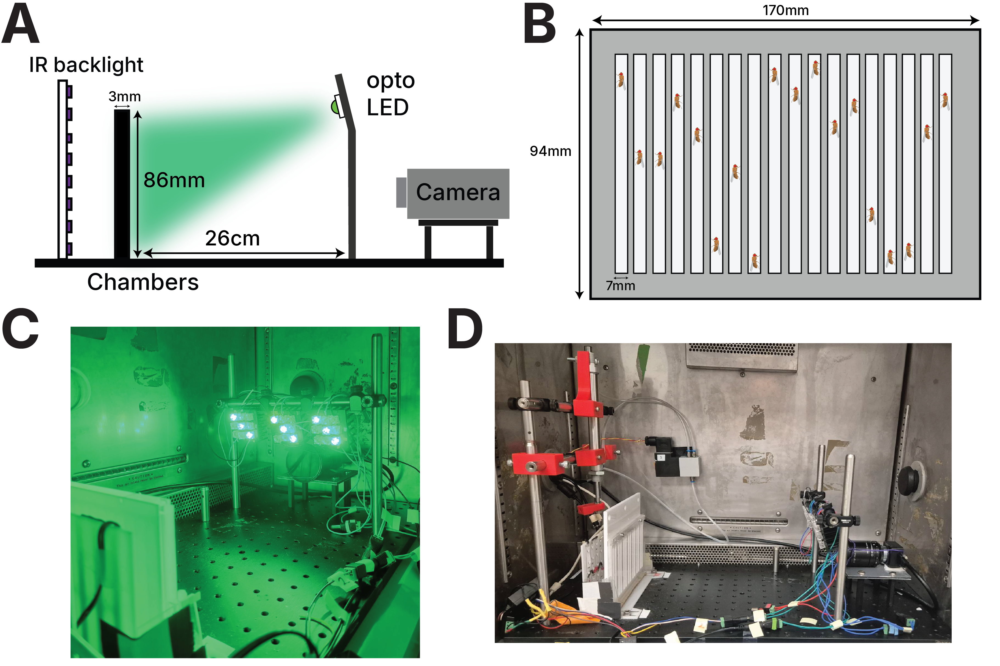
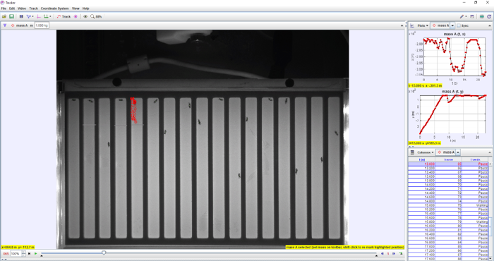
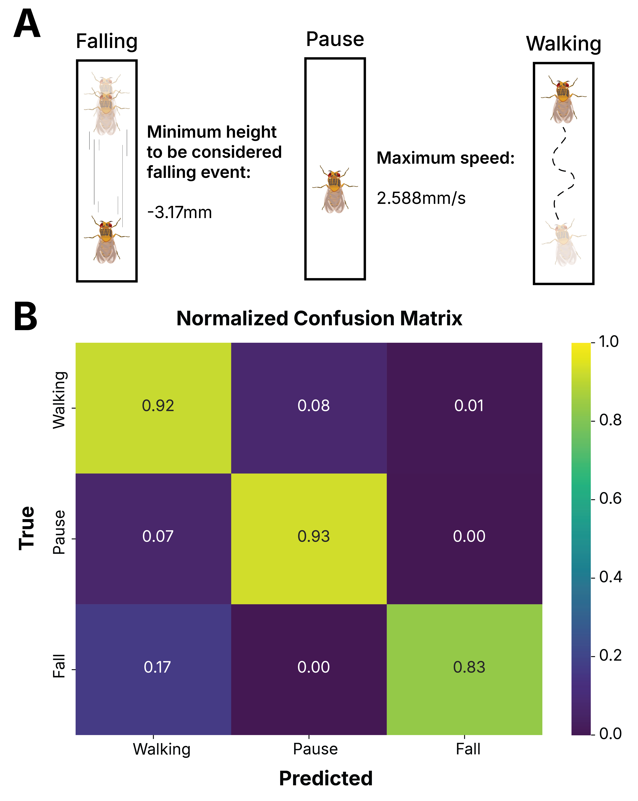

[← Back to hardware](../../hardware.qmd){.back-link}

A climbing assay reads out motor function through negative geotaxis: knock a fly to the floor of a
vertical chamber and it climbs, and how it climbs — its speed, height, falls and pauses — reports on the
motor circuitry driving the behaviour. The classic version is done by hand: tap a vial of flies and
count how many pass a line in a set time. That is enough to catch gross motor deficits, but manual
tapping agitates every fly a little differently, it leaves no precise moment to synchronise light or
tracking to, and a single pass-or-fail line throws away the shape of the climb.

That gap is what this rig was built to close. To measure *Drosophila* climbing under optogenetic control
in my thesis, I needed to agitate every fly the same way, every trial, and hand off cleanly to timed
light stimulation and frame-by-frame tracking. So I built a chamber and, around it, an automated rig
that made the startle reproducible and locked it to the optogenetics. The pneumatic and electronics
build was done in collaboration with the Duke-NUS 3D Printing & Prototyping (3DPP) Lab; credit to Dennis
Ong, who built the fabrication and microcontroller side.

### The apparatus

:::: {.columns}
::: {.column width="54%"}
{.paper-figure fig-alt="Climbing assay apparatus in four panels: (A) side schematic with IR backlight, the 3 mm x 86 mm chambers, opto LED and camera 26 cm away; (B) top-view diagram of the 170 x 94 mm cassette with 17 seven-millimetre lanes each holding a fly; (C) the green-lit rig inside the incubator; (D) the automated rig with red 3D-printed brackets, pneumatic piston and solenoid valve"}

[**Figure 1. Climbing assay apparatus.** **(A)** Schematic of the setup: an IR backlight for the
light-off phase, the fly-chamber cassette, the optogenetic LEDs, and the camera. **(B)** Diagram of the
climbing cassette with 17 individual lanes, each housing a single fly. **(C)** The rig during optogenetic
stimulation under green LED illumination. **(D)** The automated rig with the pneumatic agitation
system.]{.fig-legend}
:::
::: {.column width="4%"}
:::
::: {.column width="42%"}
Climbing behaviour is assessed in a custom acrylic cassette (170 × 94 × 9 mm) holding 17 individual
chambers (7 W × 86 H × 3 D mm), CNC-milled into a 3 mm transparent acrylic sheet mounted onto a white
acrylic diffuser (Figure 1B). One fly per lane keeps individuals in frame and physically separated, so
seventeen animals can be recorded at once without ever crossing paths, and the tall, narrow geometry
defines a repeatable climb. Flies are briefly anaesthetised on ice for 30 s, loaded one to a chamber,
and given 3 minutes to recover before any testing begins.
:::
::::

### Illumination and imaging

Optogenetic stimulation can be delivered in green (530 nm), blue (460 nm), or red, with intensity adjustable up to ~20 µW/mm². The low, tunable intensities suit light-sensitive opsins requiring minimal activation. The whole assembly sits inside a temperature-controlled incubator.

### Automated pneumatic agitation

::: {style="float:right; width:272px; max-width:46%; margin:0.2rem 0 1rem 1.6rem;"}
```{ojs}
//| echo: false
{
  const THREE = await import("https://esm.sh/three@0.160.0");
  const buf = await FileAttachment("cross-bar-to-piston-v3.stl").arrayBuffer();
  const dv = new DataView(buf);
  const n = dv.getUint32(80, true);
  const pos = new Float32Array(n * 9);
  let o = 84;
  for (let i = 0; i < n; i++) {
    o += 12;
    for (let v = 0; v < 3; v++) {
      const k = i * 9 + v * 3;
      pos[k] = dv.getFloat32(o, true);
      pos[k + 1] = dv.getFloat32(o + 4, true);
      pos[k + 2] = dv.getFloat32(o + 8, true);
      o += 12;
    }
    o += 2;
  }
  const geo = new THREE.BufferGeometry();
  geo.setAttribute("position", new THREE.BufferAttribute(pos, 3));
  geo.computeVertexNormals();
  geo.center();
  geo.computeBoundingSphere();
  const rad = geo.boundingSphere.radius;
  const W = 256, H = 264;
  const scene = new THREE.Scene();
  const cam = new THREE.PerspectiveCamera(38, W / H, 0.1, rad * 100);
  cam.position.set(0, 0, rad * 3.3);
  const mesh = new THREE.Mesh(geo, new THREE.MeshStandardMaterial({ color: 0x6f86ad, metalness: 0.2, roughness: 0.5, flatShading: true }));
  scene.add(mesh);
  scene.add(new THREE.AmbientLight(0xffffff, 0.6));
  const key = new THREE.DirectionalLight(0xffffff, 0.9); key.position.set(1, 1, 1.2); scene.add(key);
  const fill = new THREE.DirectionalLight(0xffffff, 0.3); fill.position.set(-1, 0.4, -0.6); scene.add(fill);
  const rnd = new THREE.WebGLRenderer({ antialias: true, alpha: true });
  rnd.setPixelRatio(devicePixelRatio);
  rnd.setSize(W, H);
  const dom = rnd.domElement;
  dom.style.cursor = "grab"; dom.style.touchAction = "none"; dom.style.maxWidth = "100%";
  let ry = 0.6, rx = -0.35, drag = false, lx = 0, ly = 0, auto = true;
  dom.addEventListener("pointerdown", e => { drag = true; auto = false; lx = e.clientX; ly = e.clientY; dom.setPointerCapture(e.pointerId); dom.style.cursor = "grabbing"; });
  dom.addEventListener("pointermove", e => { if (!drag) return; ry += (e.clientX - lx) * 0.01; rx += (e.clientY - ly) * 0.01; lx = e.clientX; ly = e.clientY; });
  dom.addEventListener("pointerup", () => { drag = false; dom.style.cursor = "grab"; });
  let raf;
  (function loop() { if (auto) ry += 0.004; mesh.rotation.set(rx, ry, 0); rnd.render(scene, cam); raf = requestAnimationFrame(loop); })();
  invalidation.then(() => { cancelAnimationFrame(raf); rnd.dispose(); });
  return html`<div style="border:1px solid rgba(128,128,128,.22);border-radius:12px;padding:8px;background:rgba(127,168,208,.06)">${dom}</div>`;
}
```

[One of the components cut out for the rig — the cross-bar-to-piston adapter. Drag to rotate.]{.fig-legend}
:::

Every recording set starts by displacing all seventeen flies to the bottom of their chambers. I did
this by hand at first, tapping the cassette down, but manual tapping introduced inconsistent delays
between the flies resetting and the start of tracking and light, which is exactly the temporal
precision an optogenetic experiment cannot afford to lose. So I replaced it with a pneumatic system
(Figure 1D) that agitates the same way every time and hands off cleanly to the recording.

The cassette mounts to an acrylic backboard via a single-acting pneumatic piston, held by 3D-printed adapters on optical posts to stay rigidly aligned and damp vibration. Compressed air reaches the piston through a normally-closed solenoid valve with a manual emergency release. An Arduino UNO (programmed by Dennis Ong, 3DPP Lab) controls actuation, with an OLED and rotary encoder to set parameters. Tracking pauses during agitation and resumes only once every fly is confirmed back on the chamber floor, since a stroke occasionally fails to dislodge one.

::: {style="clear:both"}
:::

### The chambers in action

<video class="paper-video" src="Chambervideo.mp4" autoplay muted loop playsinline preload="auto" controls style="max-width:760px"></video>

[**Video 1 — A recording from the cassette.** Individual flies climbing their lanes, the footage the
tracker works from frame by frame.]{.fig-legend style="max-width:760px"}

### Tracking and analysis

:::: {.columns .vmiddle}
::: {.column width="44%"}
{.paper-figure fig-alt="A cassette recording open in the Tracker software: the 17-lane chamber in greyscale near-infrared, one fly's position marked with a red trace, and a side panel of position-versus-time plots and a frame-by-frame table of behavioural states"}

[**Figure 2 — Ground-truth annotation** in Tracker.]{.fig-legend}
:::
::: {.column width="4%"}
:::
::: {.column width="52%"}
Video and positions are processed in real time by CRITTA, a tracker that segments flies from the
background by subtraction, giving x–y coordinates per fly per frame. I then wrote a custom Python
package, [DrosoClimb](https://github.com/mnicolee/DrosoClimb), to turn those raw tracks into behaviour:
it converts coordinates to millimetres, splits each trial into its dark, light and recovery phases, and
classifies every frame as walking, pausing or falling. Those thresholds come from ground truth I
hand-labelled in [Tracker](https://opensourcephysics.github.io/tracker-online/) (Figure 2). From there
it computes a range of climbing metrics, each reported as a DABEST effect size, together building an
ethomic profile of the fly's motor behaviour.
:::
::::

:::: {.columns .vmiddle}
::: {.column width="44%"}
{.paper-figure fig-alt="Behavioural event classification: (A) the three states falling, pause and walking with their thresholds; (B) a normalized confusion matrix showing 0.92 walking, 0.93 pause and 0.83 fall correctly classified"}

[**Figure 3 — Behavioural event classification.** **(A)** the states and thresholds; **(B)** the test-set confusion matrix.]{.fig-legend}
:::
::: {.column width="4%"}
:::
::: {.column width="52%"}
Every frame is scored against thresholds fixed on hand-labelled training video (17 flies, 1,810 frames,
top and bottom 10% trimmed): a fall is a downward jump beyond −3.17 mm per frame, a pause is a speed
below 2.588 mm/s, and anything faster without a fall is a walk. On an independent test set (13 flies,
1,477 frames) the classifier reads 92% of walking, 93% of pause and 83% of fall frames correctly.
:::
::::

See the science this rig was built for → the [KCR](../../papers/kcr/index.qmd) and [OPN3](../../papers/opn3/index.qmd) studies.

[]{.section-rule}
