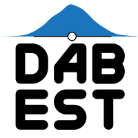

<!-- Hero is raw HTML on purpose: a Markdown `#` heading gets promoted by Quarto into a
     full-width title block, which tears the name out of this flex row. Raw HTML keeps the
     name, tagline, and headshot together in one row. 📷 headshot → nicole.png -->
```{=html}
<div class="hero">
  <div class="hero-text">
    <div class="hero-name" role="heading" aria-level="1">Nicole M. Lee, Ph.D.</div>
    <p class="tagline">Behavioral neuroscience | Optogenetics | Hardware prototyping<br>Estimation statistics | Data analysis &amp; visualization</p>
  </div>
  
</div>
```

I'm a **neuroscientist** and Research Fellow in the [**ACC Lab**](https://www.claridgechang.net/about.html) (Adam Claridge-Chang) at
Duke-NUS Medical School. My PhD centered on **advancing optogenetic methods for studying
neural circuits in behavior**: building the molecular tools, the instruments, and the
quantitative methods (statistics, data analysis, and ethomics) needed to ask how small
circuits in the *Drosophila* brain shape what an animal does.

Before the flies, I spent years in cell-division and cell-fusion biology, cancer
drug-resistance, and DNA-repair tools, so my work has spanned molecules, microscopes, and
behavior.

[]{.section-rule}

[What I do]{.eyebrow .whatido}

::: {.triptych}
::: {.panel}
[🧠]{.panel-icon}

### [The neuroscience](research.qmd){.stretched-link}
How circuits in the *Drosophila* brain shape what an animal does, and the light-driven
tools I build and validate to switch those neurons on and off (kalium channelrhodopsins,
opto-GPCRs).
:::

::: {.panel}
[🛠️]{.panel-icon}

### [The nuts & bolts](hardware.qmd){.stretched-link}
Designing the rigs that deliver the light and capture behavior: arenas, illumination,
and high-throughput tracking pipelines.
:::

::: {.panel}
{.panel-icon-img fig-alt="DABEST estimation-statistics icon"}

### [The numbers](papers/dabest/index.qmd){.stretched-link}
Estimation statistics over p-values: reporting effect sizes with bootstrap confidence
intervals rather than significance stars, plus the analysis pipelines that turn
fly-tracking data into behavioral metrics.
:::
:::
