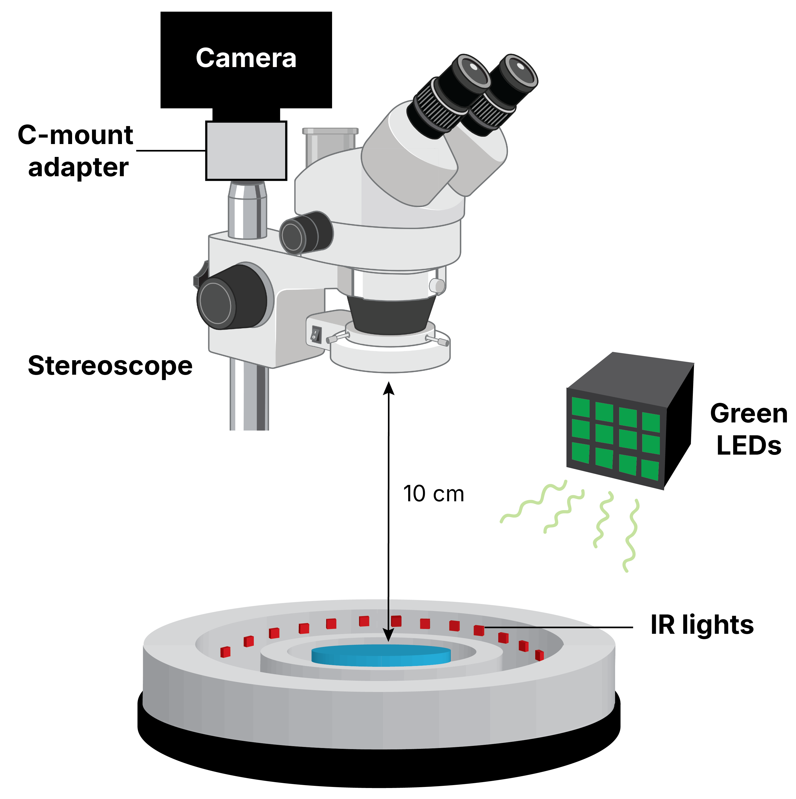

```{=html}
<!--
  The design and template of this site (its visual and interaction design: theme, colours,
  typography, and the card / hover / layout system) is the original work of Nicole M. Lee and
  may be reused with credit under CC BY 4.0.
  All written text and images are her content, all rights reserved, and are NOT for reuse.
  Source and full terms: https://github.com/mnicolee/Portfolio  (see LICENSE and AGENTS.md)
  📷 headshot → nicole.png
-->

<!-- HERO: big name + skill chips (left) · round headshot (right) -->
<div class="hero">
  <div class="hero-text">
    <div class="hero-name" role="heading" aria-level="1">Nicole M. Lee, Ph.D.</div>
    <div class="hero-sub">Computational behavioral neuroscientist &amp; hardware tinkerer</div>
  </div>
  
</div>

<!-- ABOUT (on top) — no label per Nicole -->
<div class="hsec">
  <p class="lead-p">I'm a <strong>neuroscientist</strong> in the <a href="https://www.claridgechang.net/about.html">ACC Lab</a> (Adam Claridge-Chang) at Duke-NUS Medical School, where I completed my PhD and now continue as a Research Fellow, <strong>building optogenetic methods to study how small circuits in the <em>Drosophila</em> brain shape behavior.</strong></p>
  <p class="lead-p">Before the flies, I completed my B.S. in Biochemistry at the University of Washington, Seattle, and worked on several projects: the <a href="https://orthop.washington.edu/research/ourlabs/collagen-biology-and-genetic-disorders-lab.html">biochemistry of collagen degradation</a>, <a href="https://depts.washington.edu/uwconte/chavkinlab/">mTOR and kappa-opioid receptor signaling</a>, <a href="https://cabernardlab.org/overview">asymmetric cell division</a>, and <a href="https://csi.nus.edu.sg/">cancer drug-resistance</a>. Beyond the science, I paint 🎨, game 🎮, and build apps 📱.</p>
</div>

<!-- THE THREE: icon inline with title, blurb below -->
<div class="hsec">
  <div class="three">
    <div class="col">
      <div class="k-row">
        <span class="ic ic--brain"><svg viewBox="0 0 48 48" aria-hidden="true"><path d="M24 10 C20 7 14 8 13 13 C8 13 6 19 10 22 C7 25 9 31 14 30 C15 34 22 34 24 30 C26 34 33 34 34 30 C39 31 41 25 38 22 C42 19 40 13 35 13 C34 8 28 7 24 10 Z"/><path d="M24 10 L24 30"/><path d="M17 16 C20 18 20 22 17 24"/><path d="M31 16 C28 18 28 22 31 24"/></svg></span>
        <span class="kt">The neuroscience</span>
      </div>
      <div class="kd"><strong>Optogenetics for behavioral neuroscience</strong>, developing and applying light-driven tools to manipulate neural activity, including potassium channelrhodopsins and opto-GPCRs.</div>
    </div>
    <div class="col">
      <div class="k-row">
        <span class="ic ic--wrench"><svg viewBox="0 0 48 48" aria-hidden="true"><path d="M45.4 38 l-18.2 -18.2 c1.8 -4.6 .8 -10 -3 -13.8 -4 -4 -10 -4.8 -14.8 -2.6 L18 12 12 18 3.2 9.4 C.8 14.2 1.8 20.2 5.8 24.2 c3.8 3.8 9.2 4.8 13.8 3 l18.2 18.2 c.8 .8 2 .8 2.8 0 l4.6 -4.6 c1 -.8 1 -2.2 .2 -2.8 z"/></svg></span>
        <span class="kt">The nuts &amp; bolts</span>
      </div>
      <div class="kd"><strong>Experimental hardware design</strong>, designing and prototyping custom rigs and hardware components for optogenetic stimulation and behavioral experiments.</div>
    </div>
    <div class="col">
      <div class="k-row">
        <span class="ic ic--plot"><svg viewBox="0 0 48 48" aria-hidden="true"><path d="M6 35 H42"/><path d="M9 35 C18 35 18 11 24 11 C30 11 30 35 39 35"/><path d="M24 15 V37"/><circle class="dot" cx="24" cy="25" r="3"/></svg></span>
        <span class="kt">The numbers</span>
      </div>
      <div class="kd">
        <p><strong>Estimation statistics</strong>, contributing to <a href="papers/dabest/index.html">DABEST</a> for effect sizes and confidence intervals over p-values.</p>
        <p>Building open-source Python packages for <strong>data analysis and visualization</strong>.</p>
      </div>
    </div>
  </div>
</div>

<!-- RECENT NEWS: auto-looping slideshow (newest first); each slide = name, picture, blurb -->
<div class="hsec hsec-last">
  <div class="show" data-interval="5000" aria-roledescription="carousel" aria-label="Recent news">
    <div class="show-top">
      <div class="eyebrow">Recent news</div>
      <div class="show-nav">
        <button class="nav-btn prev" type="button" aria-label="Previous news"><svg viewBox="0 0 24 24" aria-hidden="true"><path d="M15 5l-7 7 7 7"/></svg></button>
        <span class="counter" aria-live="polite">1 / 3</span>
        <button class="nav-btn next" type="button" aria-label="Next news"><svg viewBox="0 0 24 24" aria-hidden="true"><path d="M9 5l7 7-7 7"/></svg></button>
      </div>
    </div>
    <div class="slides">
      <div class="slide is-active">
        
        <div class="txt">
          <div class="m"><time>Jul 2026</time><span class="tag">Tool</span></div>
          <h3>ViSet - interactive itemized set visualization</h3>
          <p>An nbdev Python package on GitHub for itemizing and comparing sets, not just viewing them interactively.</p>
          <a class="read" href="tools/viset/index.html">read more →</a>
        </div>
      </div>
      <div class="slide">
        
        <div class="txt">
          <div class="m"><time>Jun 2026</time><span class="tag">Paper</span></div>
          <h3>OPN3 - a light-activated opto-GPCR</h3>
          <p>A light-activated GPCR that switches neuromodulatory signaling on and off, so we can dissect how specific circuits in the brain shape behavior.</p>
          <a class="read" href="papers/opn3/index.html">read more →</a>
        </div>
      </div>
      <div class="slide">
        
        <div class="txt">
          <div class="m"><time>May 2026</time><span class="tag">Hardware</span></div>
          <h3>C. elegans - a behavior tracking rig</h3>
          <p>A DIY behavior rig: custom arena, controlled illumination, camera, and a tracking pipeline for freely moving worms.</p>
          <a class="read" href="hardware/celegans/index.html">read more →</a>
        </div>
      </div>
    </div>
  </div>
</div>

<script>
(function () {
  document.querySelectorAll('.show').forEach(function (show) {
    var slides = show.querySelectorAll('.slide');
    var counter = show.querySelector('.counter');
    var prev = show.querySelector('.prev'), next = show.querySelector('.next');
    var n = slides.length, i = 0, timer = null;
    var interval = parseInt(show.getAttribute('data-interval'), 10) || 5000;
    var reduce = window.matchMedia && window.matchMedia('(prefers-reduced-motion: reduce)').matches;
    function go(k) {
      i = (k + n) % n;
      slides.forEach(function (s, j) { s.classList.toggle('is-active', j === i); });
      if (counter) counter.textContent = (i + 1) + ' / ' + n;
    }
    function start() { if (reduce) return; stop(); timer = setInterval(function () { go(i + 1); }, interval); }
    function stop() { if (timer) { clearInterval(timer); timer = null; } }
    if (prev) prev.addEventListener('click', function () { go(i - 1); start(); });
    if (next) next.addEventListener('click', function () { go(i + 1); start(); });
    show.addEventListener('mouseenter', stop);
    show.addEventListener('mouseleave', start);
    go(0); start();
  });
})();
</script>
```
