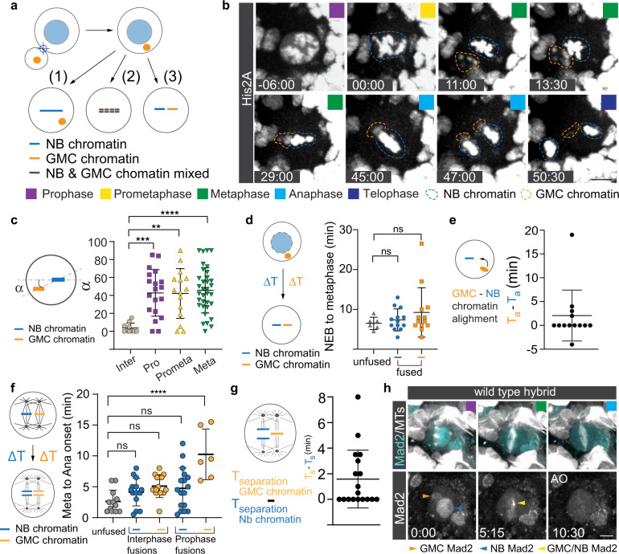

[← Back to research](../../research.qmd){.back-link}

[co-author (second author) · Communications Biology, 2022]{.paper-meta}

Every cell division must distribute its replicated chromosomes equally to the two daughter
cells, driven by microtubule spindles that attach chromosomes at their kinetochores and
segregate the two sets. Most metazoan cells build a single bipolar spindle to do so. A cell
can nonetheless end up carrying two distinct genomes, at fertilization, when egg and sperm
nuclei meet, and through cell fusion, when two cells merge into a hybrid; it must then keep
chromosomes of different origins physically separated and segregate them faithfully, and
failure can lead to chromosome missegregation and aneuploidy. Over a century ago, Aichel
proposed that unregulated somatic cell fusion could initiate tumors on this basis, since the
resulting tetraploidy and supernumerary centrosomes predispose cells to aneuploidy through
chromosome rearrangements. How a hybrid cell keeps two genomes apart inside a living animal
had not been characterized.

To watch it happen, we built a hybrid-cell model in the *Drosophila* larval brain. A brief
pulse from a 532 nm laser fuses a neural stem cell (a neuroblast) with one of its smaller,
differentiating daughters (a ganglion mother cell, or GMC), two molecularly and
epigenetically distinct cell types, turning the fused cell into a live stage for following
two genomes at once.

{.paper-figure fig-alt="Figure 1: acute laser-induced fusion of a Drosophila neuroblast and a ganglion mother cell, and the possible fates of the two chromosome sets, which independently align at the metaphase plate"}

[Figure 1 reproduced from Sunchu B., Lee N. M., Taylor J. A., Segura R. C., Roubinet C. &amp;
Cabernard C. (2022). *Asymmetric chromatin retention and nuclear envelopes separate
chromosomes in fused cells in vivo.* **Communications Biology** 5, 953.
[doi:10.1038/s42003-022-03874-z](https://doi.org/10.1038/s42003-022-03874-z). © 2022 The
Author(s). Licensed under [CC BY 4.0](https://creativecommons.org/licenses/by/4.0/).]{.figure-credit}

The first striking result was how strongly the timing of fusion shaped the outcome. Fusions
induced in interphase or early prophase let the hybrid independently congress both endogenous
(neuroblast) and ectopic (GMC) chromosomes to the metaphase plate, each aligned by a spindle
assembled from its corresponding centrosomes; fusions in metaphase or anaphase usually left
the GMC chromatin unable to align. The interval between fusion and nuclear-envelope breakdown
(NEB) also influenced spindle architecture: longer intervals were associated with two
interconnected, "X"-shaped spindles, whereas shorter intervals were associated with two
parallel "II"-type spindles, which then converged alongside each other by metaphase. The two
chromosome sets could even enter anaphase asynchronously, with ectopic chromatin trailing the
endogenous set by a few minutes, suggesting the possibility of a diffusible,
distance-dependent "wait-anaphase" signal from the spindle-assembly checkpoint.

What prevents the two genomes from intermingling before then? Two cooperating mechanisms.
First, asymmetric, microtubule-dependent chromatin retention: the neuroblast maintains a
single active apical microtubule-organizing center (MTOC) that retains its own centromeres,
marked by the CENP-A/Cid histone variant, close to the apical cortex through interphase,
keeping neuroblast chromatin away from the incoming GMC chromatin; disrupting this interphase
MTOC bias (by depleting Centrobin) let the two centromere pools converge within about a
minute of NEB, far earlier than in controls. Second, the nuclear envelopes: neuroblasts
undergo semi-closed mitosis, and each chromatin pool remains enclosed within its own nuclear
envelope, forming a physical barrier that separates them until roughly metaphase. Segregation
was error-prone, yielding lagging chromosomes, anaphase bridges and occasional micronuclei,
consistent with Aichel's century-old cancer-by-fusion hypothesis. Tellingly, we found no
evidence of active chromosome "recognition"; our findings indicate that asymmetric interphase
centrosome activity together with nuclear envelopes are sufficient to explain genome
separation in this model, a mechanism that may also operate at the first zygotic division,
where dual spindles separate maternal and paternal chromatin in insects, arthropods and
mammals.

As the paper's second author, I laid much of the groundwork for this study: through a great
deal of troubleshooting I helped establish the laser-fusion system and uncovered much of the
timing-dependent behavior at its heart, that fusing cells at different points in the cell
cycle changes whether the two genomes align and which kind of spindle forms. I also built the
foundation for the processing and analysis of the imaging data behind these results.

To learn more: [10.1038/s42003-022-03874-z](https://doi.org/10.1038/s42003-022-03874-z)

[]{.section-rule}
