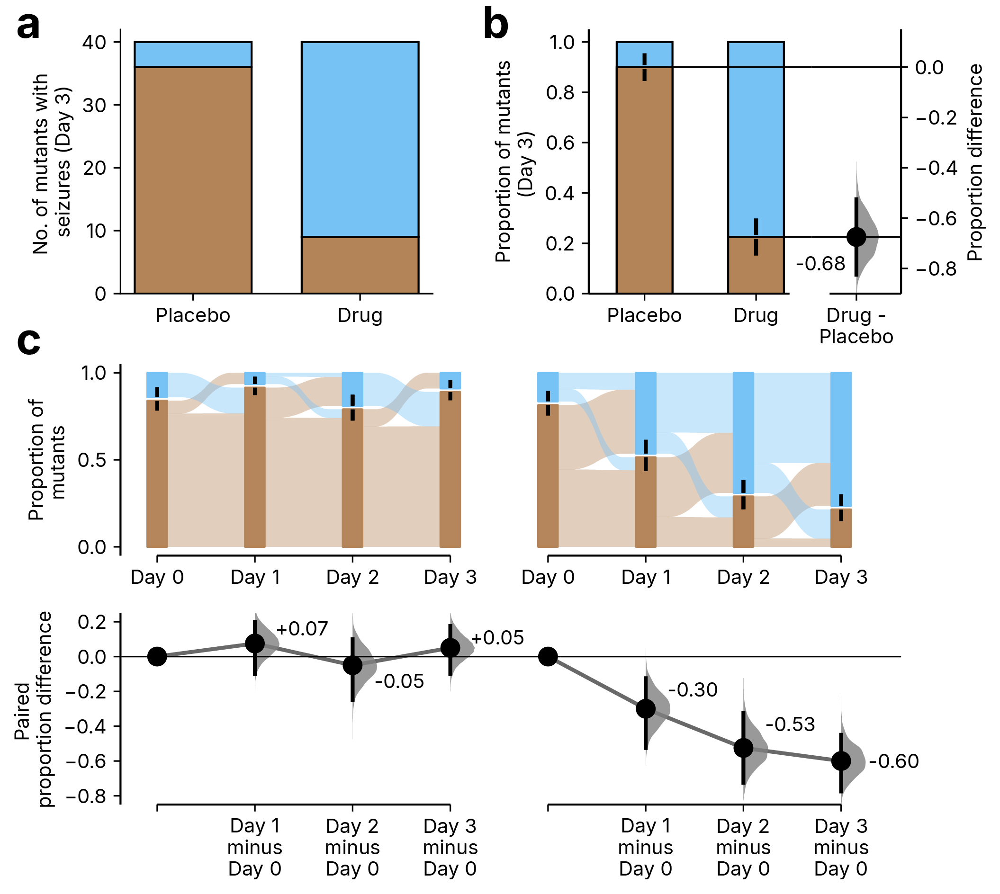

[← Back to research](../../research.qmd){.back-link}

[co-author · in revision, Nature Methods, 2026]{.paper-meta}

Most papers still lean on the p-value: a single number that says *whether* something happened,
but not by how much or how sure you can be. Estimation statistics is the alternative. **DABEST**
(Data Analysis with Bootstrap-coupled ESTimation) reports the effect size itself, wraps it in a
bootstrapped confidence interval, and plots every datapoint, so a reader sees the size of an
effect and its precision at a glance rather than a lone asterisk.

DABEST 2.0 extends that idea to the messy, multi-group designs biology actually uses:
shared-control comparisons, repeated measures, two-way factorial experiments, and meta-analysis
across replicates. It is the successor to the original estimation-graphics toolbox, built so that
complicated experiments can be read as effect sizes instead of ANOVA tables.

## My contribution: plotting proportions

Some of the most important questions in science have binary answers. Did the animal have a
seizure? Did the subject respond to the drug? Did the patient survive? I spent months
investigating how scientists actually report this kind of yes-or-no data, and what I found
was bleak. Binary outcomes are often reported with no figure at all, sometimes just a Fisher's
exact p-value buried in a table. When a figure does appear, it is usually the plainest possible
bar chart, with no error bars, no effect size, and no sense of how large or how precise the
difference really is.

My part of DABEST 2.0 was the **proportion plot**: the tool that closes this gap, together with a
supplementary table surveying how binary data is currently reported across the literature.

The figure below shows why it matters. Panel **a** is the conventional bar chart. Most placebo
animals had seizures and most drug-treated animals did not, so something clearly happened, but
the chart stops there. Panel **b** reframes the same data as proportions and plots the difference
alongside its bootstrapped 95% confidence interval. Now you can read that the drug cut the
seizure rate by 68%, and how certain that estimate is. Panel **c** carries the idea into
repeated-measures designs, following each group day by day.

{.paper-figure style="max-width:760px" fig-alt="DABEST 2.0 Figure 3. Panel a: a conventional stacked bar chart of seizures in placebo versus drug-treated mutants. Panel b: the same data as a proportion estimation plot, showing a proportion difference of minus 0.68 with a bootstrapped 95% confidence interval. Panel c: repeated-measures proportion plots tracking each group across four days."}

[The bar chart in **a** says something happened; the proportion estimation plot in **b** says by
how much (a 68% reduction) and with what certainty. Figure 3 from Lu Z., Anns J., Mai Y., Zhang R.,
Lian K., Lee N.M., Hashir S., Wang Zhouyu L., Li Y., Gonzalez A.R.C., Ho J., Choi H., Xu S. &amp;
Claridge-Chang A. (2026). *Getting over ANOVA: estimation graphics for multi-group comparisons.*
**bioRxiv**. [doi:10.64898/2026.01.26.701654](https://doi.org/10.64898/2026.01.26.701654).]{.fig-legend}

So the next time you have a binary outcome and you are reaching for a bar chart, consider a
proportion plot instead. It shows not just whether something happened, but by how much and with
what confidence, keeping the statistics rigorous while giving the reader the full picture.

To learn more: read the
[preprint on bioRxiv](https://www.biorxiv.org/content/10.64898/2026.01.26.701654v2), or explore
the [DABEST package](https://acclab.github.io/DABEST-python/).

[]{.section-rule}
