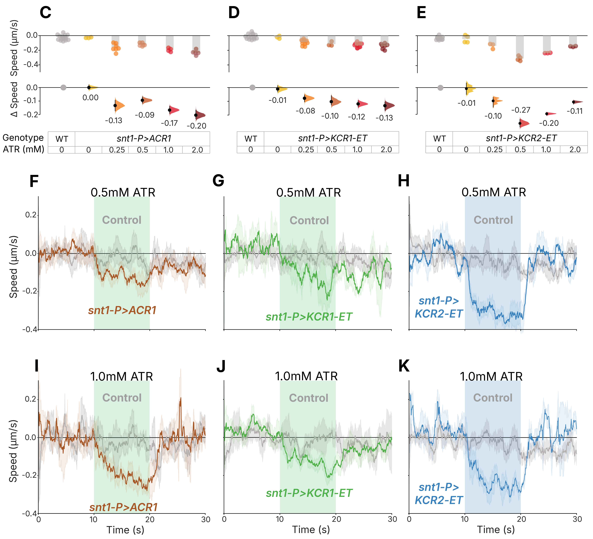

[← Back to research](../../research.qmd){.back-link}

[co-author · Nature Communications, 2024]{.paper-meta}

## What KCRs are

Optogenetics lets us switch neurons off with light, but the standard inhibitory tools,
light-gated chloride channels (anion channelrhodopsins, ACRs), have a catch: in cells or
sub-neuronal compartments with high internal chloride, a chloride current can *excite* rather
than silence. Kalium channelrhodopsins (KCRs) are light-gated channels that conduct
potassium instead, hyperpolarising a neuron independently of its chloride gradient, but
they had not been shown to reliably silence neurons in small, genetically tractable animals.

This paper put KCRs to the test as neuron silencers across three model organisms,
*Drosophila*, *C. elegans*, and zebrafish, benchmarking them directly against the widely
used chloride channel ACR1. A KCR1 variant engineered for better plasma-membrane trafficking
**matched ACR1's potency while causing less toxicity** and performing better in putative
high-chloride cells, establishing KCRs as a next-generation inhibitory tool for circuit
analysis in behaving animals.

## The *C. elegans* arm

My part of the study was the *C. elegans* behavioral work: testing whether KCRs could silence
the worm's neurons and reading that out as a measurable change in locomotion. Because no
*C. elegans* behavioral lab existed locally and a dedicated worm-tracking system would have
been cost-prohibitive, I had to **build both the assay and the tracker from the ground up**,
starting from a stereoscope and a camera.

## What was already out there

Before building anything, I surveyed the automated worm-tracking landscape. Our lab's existing
CRITTA system, built for insects, was unsuitable: the low-contrast stereoscope video gave too
little foreground–background separation, and its single centroid-and-heading output cannot
represent a body that constantly bends and coils. Among purpose-built worm trackers, classical
computer-vision pose estimators need high spatial resolution^2--8^ and adequate
contrast^5,9--11^ to extract limb edges reliably; low contrast defeats edge detectors
regardless of pixel count^8,12--15^, and coiling or overlap forces most trackers to discard
those events or require manual re-linking^4^. Skeleton-based systems such as Tierpsy
Tracker^16,17^ extract more than 256 features but typically need ≥1280×1024 resolution with
good contrast, and many high-end platforms require expensive specialized hardware, confocal
microscopes, motorized stages, or high-speed cameras^1,18--24^. Deep-learning trackers are
more robust to image-quality variation, including YOLO-based^9,25^ and Swin Transformer^26^
architectures. I tested classical tools (Tierpsy Tracker^16,17^ and wrMTrck^27^), but they
failed to detect worms in our low-contrast video, and worm-specific deep-learning systems were
hard to implement at our resolution. I therefore chose DeepLabCut (DLC)^28^, a
general-purpose pose-estimation framework I could train on our own data. Full comparisons are
in Tables D.4 and D.5 below.

::: {.column-page}

Full comparison — Tables D.4 &amp; D.5 (classical &amp; machine-learning worm trackers)

<strong>Table D.4.</strong> Classical computer-vision methods for <em>C. elegans</em> tracking. Imaging requirements, detection and segmentation, skeleton extraction, tracking algorithm, and behavioral feature outputs. GUI, graphical user interface.

<table style="width:100%;">
<colgroup>
<col style="width: 6%" />
<col style="width: 9%" />
<col style="width: 11%" />
<col style="width: 9%" />
<col style="width: 4%" />
<col style="width: 8%" />
<col style="width: 11%" />
<col style="width: 9%" />
<col style="width: 9%" />
<col style="width: 7%" />
<col style="width: 11%" />
</colgroup>
<thead>
<tr>
<th><strong>Tracker</strong></th>
<th><strong>Required Resolution</strong></th>
<th><strong>Camera/Setup</strong></th>
<th><strong>Single/Multi Organism</strong></th>
<th><strong>GUI</strong></th>
<th><strong>Detection Method</strong></th>
<th><strong>Segmentation Method</strong></th>
<th><strong>Skeleton Extraction</strong></th>
<th><strong>Tracking Algorithm</strong></th>
<th><strong>Overlap</strong></th>
<th><strong>Features</strong></th>
</tr>
</thead>
<tbody>
<tr>
<td><strong>Worm Tracker 2.0</strong> 29</td>
<td>640x480</td>
<td>Motorized x-y stage, DinoLite AM413T camera with zoom magnification</td>
<td>Single</td>
<td>Yes</td>
<td>Thresholding + morphology</td>
<td>Morphological operations</td>
<td>49-point skeleton</td>
<td>Stage tracking (follows worm)</td>
<td>
N/A

(single worm)
</td>
<td>702 features</td>
</tr>
<tr>
<td><strong>Nemo</strong> 30</td>
<td>800x600</td>
<td>Zeiss Stemi SV11 stereomicroscope + Moticam 2000 CCD</td>
<td>Single</td>
<td>Yes</td>
<td>Thresholding</td>
<td>Morphological operations + skeletonization</td>
<td>Yes (7 segments)</td>
<td>Frame-to-frame linking</td>
<td>
N/A

(single worm)
</td>
<td>Speed, direction change, wavelength, amplitude, body thickness</td>
</tr>
<tr>
<td><strong>Parallel Worm Tracker</strong> 2</td>
<td>640x480 pixels</td>
<td>DCAM-compatible video camera (XCD-900, Sony), + zoom lens with C -mount adapter</td>
<td>Multiple (parallel tracking)</td>
<td>Yes</td>
<td>Thresholding</td>
<td>Thresholding</td>
<td>No (centroid only)</td>
<td>Multi-object linking</td>
<td>N/A</td>
<td>Speed, paralysis fraction</td>
</tr>
<tr>
<td><strong>Track-A-Worm</strong> 4</td>
<td>1920x1080</td>
<td>Stereomicroscope, motorized x-y stage, camera</td>
<td>Single</td>
<td>Yes</td>
<td>Thresholding + corner detection</td>
<td>Thresholding + corner detection</td>
<td>13-point cubic spline</td>
<td>Stage tracking (re-centers at 1-sec intervals)</td>
<td>
N/A

(single worm)
</td>
<td>Speed, distance, direction, bending frequency, amplitude</td>
</tr>
<tr>
<td><strong>Multi-Worm Tracker</strong> 3</td>
<td>2,352 x 1,728 pixels</td>
<td>Dalsa Falcon 4M30, frame grabber, backlight</td>
<td>5-120</td>
<td>Lab View</td>
<td>Thresholding + flood-fill</td>
<td>Threshold + flood-fill from dark pixels</td>
<td>11-point spine</td>
<td>Real-time object association</td>
<td>Partial (loses identity upon collision)</td>
<td>Speed, angular speed, area, spine length, curvature, body bends</td>
</tr>
<tr>
<td><strong>CeleST</strong> 31</td>
<td>0.02 mm/pixel minimum, 696 x 520pixel</td>
<td>Digital Camera</td>
<td>1-5</td>
<td>Yes</td>
<td>Thresholding + curvature</td>
<td>Curvature-based centerline</td>
<td>Yes</td>
<td>Per-frame</td>
<td>Partial</td>
<td>10 swimming parameters</td>
</tr>
<tr>
<td><strong>wrMTrck</strong> 27</td>
<td>640x480 (flexible)</td>
<td>USB microscope</td>
<td>Multiple (~8)</td>
<td>Yes</td>
<td>Max entropy thresholding</td>
<td>Thresholding</td>
<td>No (ellipse fitting)</td>
<td>Centroid linking</td>
<td>Breaks tracks</td>
<td>Size, velocity, BLPS, BBPS</td>
</tr>
<tr>
<td><strong>CoLBeRT</strong> 32</td>
<td>~30 µm (swimming), ~5 µm limit (crawling)</td>
<td>10X Nikon Eclipse TE2000-U with PhotonFocus MV2-D1280-640CL (high-speed)</td>
<td>Single</td>
<td>Yes</td>
<td>Thresholding + boundary detection</td>
<td>Thresholding (filtered image)</td>
<td>Yes - centerline with 100 segments</td>
<td>MindControl: Stage-tracking + boundary/centerline extraction</td>
<td>N/A</td>
<td>Centroid, curvature, bending wave speed, head/tail position</td>
</tr>
<tr>
<td><strong>WF-NTP</strong> 5</td>
<td>≥6 megapixel recommended</td>
<td>6MP camera (Edmund Optics, model no. GS3-U3-41C6M-C) + flat-field illumination</td>
<td>Up to 5,000</td>
<td>Yes</td>
<td>Adaptive Gaussian thresholding</td>
<td>Gaussian thresholding + morphology</td>
<td>Skeletonization (for centroid)</td>
<td>Collision-aware tracking</td>
<td>Partial</td>
<td>Speed, paralysis, area</td>
</tr>
<tr>
<td><strong>3D-worm tracker</strong> 33</td>
<td>550x550 (trajectory analysis); 1024x1024 + 1600x1200 (kinematic)</td>
<td>FASTCAM SA1.1 + PCO.1600 dual cameras (stereoscopic)</td>
<td>Single</td>
<td>No</td>
<td>Thresholding + stereomatching</td>
<td>Thresholding + stereo reconstruction</td>
<td>Yes (3D skeleton, 13 sections)</td>
<td>Manual stage control + per-frame</td>
<td>Detects Coiling</td>
<td>3D trajectory, 3D posture, bending vectors</td>
</tr>
<tr>
<td><strong>Tierpsy Tracker</strong> 16,17</td>
<td>&gt;75pixels/mm or 1280 x 1024</td>
<td>Standard camera + light source</td>
<td>Single and multi-worm</td>
<td>Yes</td>
<td>Adaptive thresholding</td>
<td>Adaptive thresholding + size filtering</td>
<td>segWorm algorithm (from Worm Tracker 2.0) - identifies contour points with highest curvature, divides contour into ventral/dorsal, calculates midline</td>
<td>Frame-to-frame trajectory joining</td>
<td>No</td>
<td>256+ features</td>
</tr>
</tbody>
</table>

<strong>Table D.5.</strong> Machine-learning methods for <em>C. elegans</em> tracking. Deep-learning approaches for worms and other organisms: architectures for detection, segmentation, and pose estimation; worm-specific tools and adaptable general-purpose frameworks. CNN, convolutional neural network; YOLO, You Only Look Once; SORT, Simple Online and Realtime Tracking; ReID, re-identification.

<table>
<colgroup>
<col style="width: 7%" />
<col style="width: 9%" />
<col style="width: 11%" />
<col style="width: 9%" />
<col style="width: 4%" />
<col style="width: 9%" />
<col style="width: 11%" />
<col style="width: 9%" />
<col style="width: 8%" />
<col style="width: 6%" />
<col style="width: 11%" />
</colgroup>
<thead>
<tr>
<th><strong>Tracker</strong></th>
<th><strong>Required Resolution</strong></th>
<th><strong>Camera/Setup</strong></th>
<th><strong>Single/Multi Organism</strong></th>
<th><strong>GUI</strong></th>
<th><strong>Detection Method</strong></th>
<th><strong>Segmentation Method</strong></th>
<th><strong>Skeleton Extraction</strong></th>
<th><strong>Tracking Algorithm</strong></th>
<th><strong>Overlap</strong></th>
<th><strong>Features</strong></th>
</tr>
</thead>
<tbody>
<tr>
<td>
<strong>Deep</strong>

<strong>Tangle</strong>7
</td>
<td>512 x 512 resolution</td>
<td>Standard microscopy</td>
<td>Multiple, up to 6000</td>
<td>No</td>
<td>Single-stage detection model with ResNet backbone</td>
<td>None - bypasses and uses neural networks</td>
<td>Direct prediction by CNN</td>
<td>Linear assignment problem with directed metric</td>
<td>
Limited

coiling
</td>
<td>centerline angle, center-of-mass speed, curvature</td>
</tr>
<tr>
<td>
<strong>Deep</strong>

<strong>Tangle</strong>

<strong>Crawl</strong> 10
</td>
<td>12.4 µm/pixel</td>
<td>Megapixel camera arrays</td>
<td>Multiple</td>
<td>Yes</td>
<td>DeepTangle (modified ResNet backbone + YOLO-style grid output)</td>
<td>None - bypasses pixel segmentation entirely</td>
<td>Direct CNN prediction</td>
<td>Built-in temporal tracking (11-frame context)</td>
<td>Yes</td>
<td>256 features similar to Tierpsy</td>
</tr>
<tr>
<td><strong>Deep-Worm-Tracker</strong> 9</td>
<td>0.8 MP, 2 MP, 5 MP</td>
<td>CMOS camera + Leica stereo microscope</td>
<td>Multiple</td>
<td>No</td>
<td>YOLOv5 object detection</td>
<td>Threshold-based</td>
<td>Yes - morphological skeletonization</td>
<td>Strong SORT (appearance + motion + Kalman + Hungarian Assignment)</td>
<td>Partial</td>
<td>Trajectory</td>
</tr>
<tr>
<td>
<strong>Worm</strong>

<strong>Swin</strong> 26
</td>
<td>800px x 1333px</td>
<td>N/A</td>
<td>Multiple</td>
<td>No</td>
<td>Hybrid Task Cascade (HTC) + Swin Transformer backbone</td>
<td>Instance segmentation (end-to-end deep learning)</td>
<td>No -outputs masks only</td>
<td>Simple IoU-based matching: Match highest overlapping masks between consecutive frames</td>
<td>Yes</td>
<td>Bounding boxes + instance segmentation masks</td>
</tr>
<tr>
<td>
<strong>Worm</strong>

<strong>YOLO</strong> 25
</td>
<td>640 x 480</td>
<td>Standard microscopy</td>
<td>Multiple</td>
<td>No</td>
<td>YOLO + RepLKNet</td>
<td>Instance segmentation (end-to-end deep learning)</td>
<td>Yes - post-processing algorithm on segmented masks</td>
<td>BoT-SORT + Kalman filter + Hungarian algorithm + ReID appearance features</td>
<td>Partial</td>
<td>Head/body/tail bend count, max bend speed, body length, frames where head-tail distance &lt; 20% body length</td>
</tr>
<tr>
<td><strong>YOLOv8</strong> 34</td>
<td>1024 x 1024 pixels</td>
<td>Olympus SZX7 stereo microscope + DP20 camera; Custom microscope + Mshiwi SUA134GC/M industrial camera</td>
<td>Multiple</td>
<td>N/A</td>
<td>CSPDarknet backbone + PANet neck + Detection head</td>
<td>YOLO-style bounding box detection</td>
<td>None - indirect via bounding box</td>
<td>ByteTrack + Kalman filter</td>
<td>Partial</td>
<td>~7 types</td>
</tr>
<tr>
<td>
<strong>Worm</strong>

<strong>Pose</strong> 35
</td>
<td>Not specified</td>
<td>Standard microscopy setup</td>
<td>Single</td>
<td>No</td>
<td>CNN-based</td>
<td>Generative model + CNN</td>
<td>Yes (pose estimation, reverse skeletonization)</td>
<td>Per-frame pose estimation</td>
<td>
Detects Coiling

(single worm)
</td>
<td>Posture angles</td>
</tr>
<tr>
<td><strong>Deep Lab Cut (DLC)</strong> 28</td>
<td>minimum 640 x 480 (low-res)</td>
<td>N/A</td>
<td>Multiple</td>
<td>Yes</td>
<td>DeeperCut feature detectors (ResNet-50 + deconvolutional layers)</td>
<td>Direct keypoint detection</td>
<td>User-defined keypoints - not automatic skeleton</td>
<td>Frame-by-frame detection</td>
<td>N/A</td>
<td>x, y coords + likelihood per bodypart per frame</td>
</tr>
<tr>
<td>
<strong>Social LEAP Estimates Animal Poses</strong>

<strong>(SLEAP)</strong>

36
</td>
<td>1,024 x 1,024 pixels</td>
<td>No specific camera required</td>
<td>Multiple</td>
<td>Yes</td>
<td>Deep learning-based pose estimation using CNN</td>
<td>Confidence maps (2D Gaussians); multi-class segmentation maps for ID models</td>
<td>User-defined nodes and edges; skeleton modeled as directed tree</td>
<td>Flow-shift or appearance-based ID classification with optimal assignment</td>
<td>Yes</td>
<td>x, y coords + point/instance/tracking scores per node per track per frame</td>
</tr>
</tbody>
</table>

:::

## So we built our own

None of the existing options fit a low-contrast, low-cost stereoscope setup, so I built a
dedicated *C. elegans* optogenetics-and-tracking rig from the ground up: custom CNC-milled
chambers held together with magnets, a 3D-printed camera adapter, infrared and optogenetic
illumination, and a DeepLabCut tracker trained on our own footage.

[Click here to see how we made it → the *C. elegans* tracking rig](../../hardware/celegans/index.qmd){.read-more}

## What we found

{.paper-figure style="max-width:760px" fig-alt="Truncated crop of Figure 5 showing the C. elegans results: pan-neuronally expressed opsins slow worm movement during green illumination"}

[A crop of the paper's Figure 5 showing the *C. elegans* results — the part I worked on: pan-neuronally
expressed opsins reduce worm movement during green illumination, with rapid recovery once the light is
off. Figure 5 (cropped to the *C. elegans* results) from Ott S., Xu S., Lee N., Hong I., Anns J.,
Suresh D. D., Zhang Z., Zhang X., Harion R., Ye W., Chandramouli V., Jesuthasan S., Saheki Y. &amp;
Claridge-Chang A. (2024). *Kalium channelrhodopsins effectively inhibit neurons.* **Nature
Communications** 15, 3480. [doi:10.1038/s41467-024-47203-w](https://doi.org/10.1038/s41467-024-47203-w).
© 2024 The Author(s). Licensed under [CC BY 4.0](https://creativecommons.org/licenses/by/4.0/).]{.fig-legend style="max-width:760px"}

To read out silencing, worms expressing each opsin pan-neuronally were reared on a range of
all-*trans*-retinal (ATR) concentrations and filmed on the rig. Every opsin-expressing line
slowed markedly during green illumination, and the enhanced-trafficking (ET) tag improved
membrane targeting in the worm just as it had in flies and cultured cells. The efficacy ranking
was KCR2-ET > ACR1 > KCR1-ET, varying with ATR concentration, and all animals recovered quickly
once the light went off, with no meaningful difference in recovery time between genotypes. For
the worm, then, the potassium-conducting KCR2-ET matched the chloride channel ACR1.

Across the whole study, the trafficking-enhanced KCR1 matched ACR1's potency in flies, worms,
and zebrafish while showing lower developmental toxicity and better performance in putative
high-chloride cells, making the case for KCRs as next-generation silencers.

The work was covered in *The Straits Times* (2024).

To learn more: [10.1038/s41467-024-47203-w](https://doi.org/10.1038/s41467-024-47203-w)

[]{.section-rule}

## References

::: {.references}

1\. Stephens, G. J., Johnson-Kerner, B., Bialek, W. & Ryu, W. S. Dimensionality and dynamics in the behavior of C. elegans. *PLoS Comput. Biol.* **4**, e1000028 (2008).

2\. Ramot, D., Johnson, B. E., Berry, T. L., Jr, Carnell, L. & Goodman, M. B. The Parallel Worm Tracker: a platform for measuring average speed and drug-induced paralysis in nematodes. *PLoS One* **3**, e2208 (2008).

3\. Swierczek, N. A., Giles, A. C., Rankin, C. H. & Kerr, R. A. High-throughput behavioral analysis in C. elegans. *Nat. Methods* **8**, 592--598 (2011).

4\. Wang, S. J. & Wang, Z.-W. Track-a-worm, an open-source system for quantitative assessment of C. elegans locomotory and bending behavior. *PLoS One* **8**, e69653 (2013).

5\. Koopman, M. *et al.* Assessing motor-related phenotypes of Caenorhabditis elegans with the wide field-of-view nematode tracking platform. *Nat. Protoc.* **15**, 2071--2106 (2020).

6\. Layana Castro, P. E., Puchalt, J. C., García Garví, A. & Sánchez-Salmerón, A.-J. Caenorhabditis elegans multi-tracker based on a modified skeleton algorithm. *Sensors (Basel)* **21**, 5622 (2021).

7\. Alonso, A. & Kirkegaard, J. B. Fast detection of slender bodies in high density microscopy data. *Commun. Biol.* **6**, 754 (2023).

8\. Layana Castro, P. E., García Garví, A., Navarro Moya, F. & Sánchez-Salmerón, A.-J. Skeletonizing Caenorhabditis elegans based on U-Net architectures trained with a multi-worm low-resolution synthetic dataset. *Int. J. Comput. Vis.* **131**, 2408--2424 (2023).

9\. Banerjee, S. C., Khan, K. A. & Sharma, R. Deep-worm-tracker: Deep learning methods for accurate detection and tracking for behavioral studies in C. elegans. *Appl. Anim. Behav. Sci.* **266**, 106024 (2023).

10\. Weheliye, W. H. *et al.* A neural network model enables worm tracking in challenging conditions and increases signal-to-noise ratio in phenotypic screens. *PLoS Comput. Biol.* **21**, e1013345 (2025).

11\. Benji, N. A guide to robust edge detection with OpenCV. *Medium* https://medium.com/@noel.benji/a-guide-to-robust-edge-detection-with-opencv-1d703506e014 (2025).

12\. Roussel, N., Sprenger, J., Tappan, S. J. & Glaser, J. R. Robust tracking and quantification of C. elegans body shape and locomotion through coiling, entanglement, and omega bends. *Worm* **3**, e982437 (2014).

13\. Spontón, H. & Cardelino, J. A review of classic edge detectors. *Image Process. Line* **5**, 90--123 (2015).

14\. Ofir, N. *et al.* On detection of faint edges in noisy images. *arXiv \[cs.CV\]* (2017).

15\. Muntarina, K., Mostafiz, R., Shorif, S. B. & Shorif Uddin, M. Deep learning-based edge detection for random natural images. *Neurosci. Inform.* **5**, 100183 (2025).

16\. Javer, A. *et al.* An open-source platform for analyzing and sharing worm-behavior data. *Nat. Methods* **15**, 645--646 (2018).

17\. Barlow, I. L. *et al.* Megapixel camera arrays enable high-resolution animal tracking in multiwell plates. *Commun. Biol.* **5**, 253 (2022).

18\. Wang, W., Sun, Y., Dixon, S. J., Alexander, M. & Roy, P. J. An automated micropositioning system for investigating C. elegans locomotive behavior. *J. Lab. Autom.* **14**, 269--276 (2009).

19\. Stirman, J. N., Brauner, M., Gottschalk, A. & Lu, H. High-throughput study of synaptic transmission at the neuromuscular junction enabled by optogenetics and microfluidics. *J. Neurosci. Methods* **191**, 90--93 (2010).

20\. Stirman, J. N. *et al.* Real-time multimodal optical control of neurons and muscles in freely behaving Caenorhabditis elegans. *Nat. Methods* **8**, 153--158 (2011).

21\. Leifer, A. M., Fang-Yen, C., Gershow, M., Alkema, M. J. & Samuel, A. D. T. Optogenetic manipulation of neural activity in freely moving Caenorhabditis elegans. *Nat. Methods* **8**, 147--152 (2011).

22\. Faumont, S. *et al.* An image-free opto-mechanical system for creating virtual environments and imaging neuronal activity in freely moving Caenorhabditis elegans. *PLoS One* **6**, e24666 (2011).

23\. Gengyo-Ando, K. *et al.* A new platform for long-term tracking and recording of neural activity and simultaneous optogenetic control in freely behaving Caenorhabditis elegans. *J. Neurosci. Methods* **286**, 56--68 (2017).

24\. Qiu, Z. *et al.* An integrated platform enabling optogenetic illumination of Caenorhabditis elegans neurons and muscular force measurement in microstructured environments. *Biomicrofluidics* **9**, 014123 (2015).

25\. Dong, B. & Chen, W. A high precision method of segmenting complex postures in Caenorhabditis elegans and deep phenotyping to analyze lifespan. *Sci. Rep.* **15**, 8870 (2025).

26\. Deserno, M. & Bozek, K. WormSwin: Instance segmentation of C. elegans using vision transformer. *Sci. Rep.* **13**, 11021 (2023).

27\. Nussbaum-Krammer, C. I., Neto, M. F., Brielmann, R. M., Pedersen, J. S. & Morimoto, R. I. Investigating the spreading and toxicity of prion-like proteins using the metazoan model organism C. elegans. *J. Vis. Exp.* 52321 (2015).

28\. Mathis, A. *et al.* DeepLabCut: markerless pose estimation of user-defined body parts with deep learning. *Nat. Neurosci.* **21**, 1281--1289 (2018).

29\. Yemini, E., Jucikas, T., Grundy, L. J., Brown, A. E. X. & Schafer, W. R. A database of Caenorhabditis elegans behavioral phenotypes. *Nat. Methods* **10**, 877--879 (2013).

30\. Tsibidis, G. D. & Tavernarakis, N. Nemo: a computational tool for analyzing nematode locomotion. *BMC Neurosci.* **8**, 86 (2007).

31\. Restif, C. *et al.* CeleST: computer vision software for quantitative analysis of C. elegans swim behavior reveals novel features of locomotion. *PLoS Comput. Biol.* **10**, e1003702 (2014).

32\. Yu, X. *et al.* Fast deep neural correspondence for tracking and identifying neurons in C. elegans using semi-synthetic training. *Elife* **10**, e66410 (2021).

33\. Kwon, N., Pyo, J., Lee, S.-J. & Je, J. H. 3-D worm tracker for freely moving C. elegans. *PLoS One* **8**, e57484 (2013).

34\. Liu, X. *et al.* Automated C. elegans behavior analysis via deep learning-based detection and tracking. *PLoS Comput. Biol.* **21**, e1013707 (2025).

35\. Hebert, L., Ahamed, T., Costa, A. C., O'Shaughnessy, L. & Stephens, G. J. WormPose: Image synthesis and convolutional networks for pose estimation in C. elegans. *PLoS Comput. Biol.* **17**, e1008914 (2021).

36\. Pereira, T. D. *et al.* SLEAP: A deep learning system for multi-animal pose tracking. *Nat. Methods* **19**, 486--495 (2022).

:::
