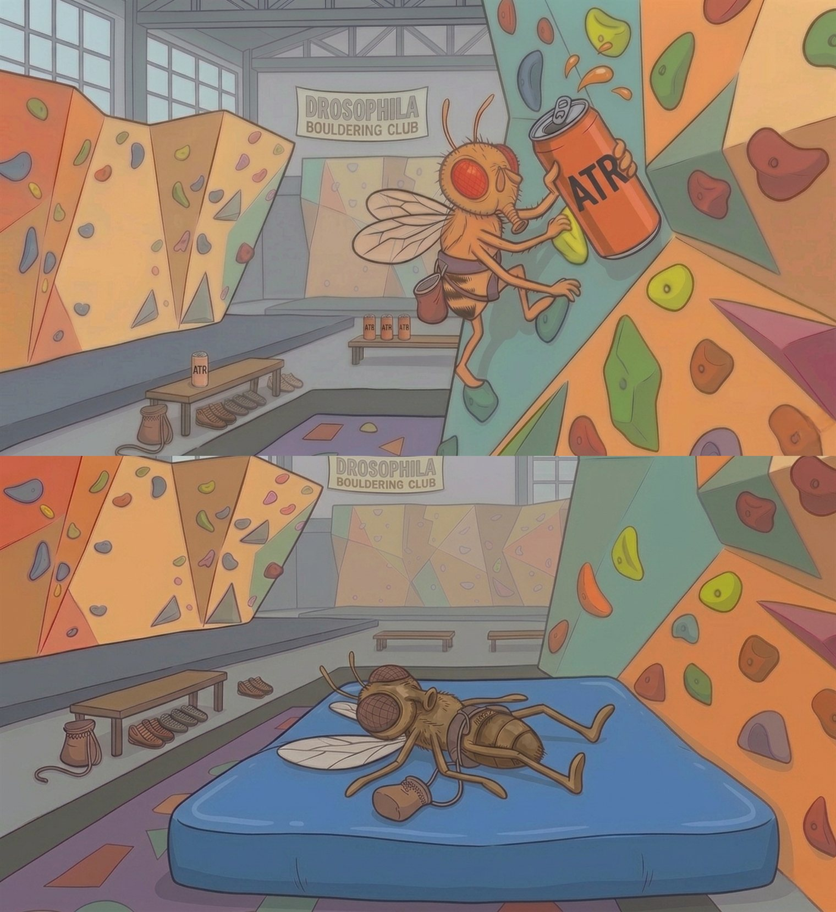

[← Back to research](../../research.qmd){.back-link}

[co-first author · preprint · bioRxiv, 2026]{.paper-meta}

Most optogenetic silencers, such as the light-gated chloride channel GtACR1, only work while the
light is on. As soon as the light goes off, the neuron becomes active again. That's a problem for
behavioral experiments, where prolonged illumination can influence the very behavior you're trying
to measure.

## The tool: a light-triggered, self-sustaining silencer (OPN3)

{.graphical-abstract style="max-width:760px" fig-alt="Graphical abstract: a brief green light pulse gives GtACR1 transient inhibition but OPN3, a bistable Gi/o GPCR, prolonged inhibition; OPN3 silencing is tested in Drosophila memory and locomotion assays"}

[**Figure 1.** Graphical abstract from Lee N.M., Mai Y., Dalberg L., Anns J.C., Suresh D.D., Zhang Z. &amp;
Claridge-Chang A. (2026). *Brief illumination of an optoGPCR elicits prolonged inhibition of
Drosophila behavior.* **bioRxiv**.]{.figure-credit style="max-width:760px"}

This work introduces a different kind of optogenetic silencer. OPN3, Opsin3 from the mosquito
*Anopheles stephensi*, is a bistable Gi/o-coupled GPCR: a brief flash of green light triggers an
intracellular signaling cascade that keeps neurons inhibited long after the light is gone. We
screened three optoGPCRs in adult *Drosophila*, and OPN3 clearly performed best. To our knowledge,
it is the first GPCR opsin shown to inhibit behavior in adult *Drosophila*. A light pulse as short
as five seconds silenced behavior for *minutes*, and a single pulse was enough to abolish aversive
olfactory learning across a one-minute training period. When benchmarked directly against GtACR1 in
walking and memory assays, OPN3 produced comparable silencing across most neuronal populations while
causing substantially less developmental toxicity and improving viability.

Because OPN3 continues working after the light is turned off, you can stimulate once and then record
entirely in the dark. That matters whenever the stimulation light would otherwise interfere with the
experiment, whether through cumulative light exposure during long recordings, incompatibility with
calcium imaging, or heating and phototoxicity. Vision is a particularly good example: the same light
needed to keep a conventional silencer active also stimulates the visual circuits you're trying to
study. OPN3 avoids that problem by separating the stimulation from the observation, letting you
deliver a brief pulse first and then watch behavior in darkness.

## The second finding: developmental retinal (ATR) is a lever on performance

Every opsin also needs a light-absorbing chromophore to function. The protein itself is an apoprotein
and only becomes light-sensitive once retinal is bound. Because *Drosophila* produce too little
retinal on their own, optogenetic experiments almost always involve feeding flies all-trans-retinal
(ATR). By convention, that feeding begins in adulthood, after the neurons have already developed.

{.paper-figure style="max-width:760px" fig-alt="A two-panel cartoon set at the 'Drosophila Bouldering Club': in the top panel a bright, energetic fruit fly scales a colorful climbing wall while drinking from a red can labeled ATR; in the bottom panel a pale, exhausted fly with no ATR lies collapsed on the crash mat below."}

[**Figure 2.** *No ATR, no life.* Graphical representation of ATR with regards to performance and
survival. Illustration created with Nano Banana Pro, 15 June 2026.]{.figure-credit style="max-width:760px"}

We asked whether the timing of retinal availability mattered. Instead of feeding ATR only in
adulthood, we reared flies on ATR-supplemented food throughout development. The result was
surprisingly simple: flies were healthier, survived to adulthood more often, and both OPN3 and
GtACR1 produced stronger optogenetic silencing. Because the same effect appeared in two
mechanistically different tools, it points to developmental retinal availability as a general
determinant of optogenetic performance, rather than something unique to a single opsin. In practice,
it's a simple and inexpensive change that improves both animal health and experimental performance.

To learn more: read the preprint on
[bioRxiv](https://www.biorxiv.org/content/10.64898/2026.05.26.727874v1),
[doi:10.64898/2026.05.26.727874](https://doi.org/10.64898/2026.05.26.727874).

[]{.section-rule}
