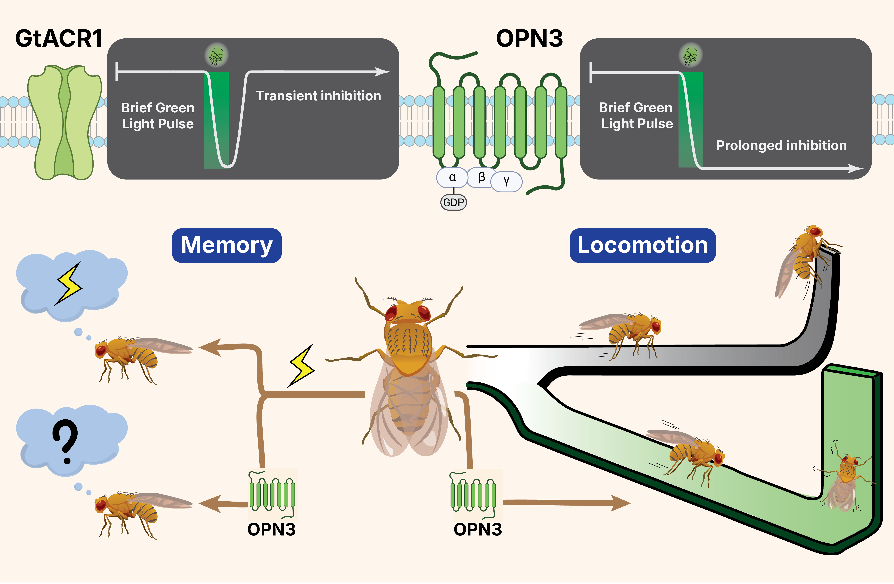
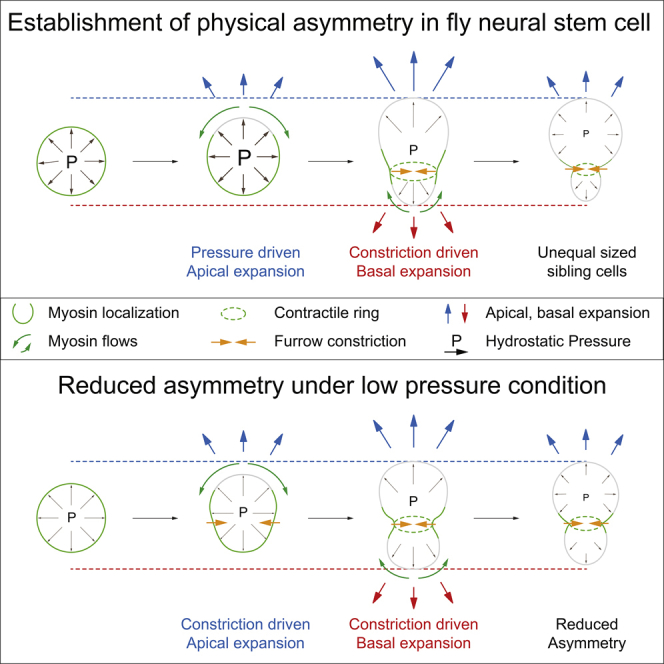

[Selected research]{.eyebrow}

::::: {.card-grid}

:::: {.pcard .is-soon}

Coming soon

::: {.pcard-body}
### Untangling internal state from locomotion using behavioral ethomics
[PhD thesis · first-author · unpublished data]{.paper-meta}

An optogenetic screen of the mushroom body output neuron (MBON) split-GAL4 library across
two custom assays, asking how internal state and movement get entangled in *Drosophila* circuits.
:::

::::

:::: {.pcard}

::: {.pcard-body}
### [The silence after the light](papers/opn3/index.qmd){.stretched-link}
[co-first author · preprint · bioRxiv, 2026]{.paper-meta}

A single brief flash of green light on the bistable opto-GPCR OPN3 silences *Drosophila*
neurons for minutes — a low-toxicity silencing tool for circuit and behavior work.
:::

::::

:::: {.pcard}

::: {.pcard-body}
### [DABEST 2.0: estimation statistics](papers/dabest/index.qmd){.stretched-link}
[co-author · in revision, Nature Methods, 2026]{.paper-meta}

Estimation graphics for effect sizes over p-values. I built the proportion plot for binary
data, and the literature survey behind it.
:::

::::

:::: {.pcard}

::: {.pcard-body}
### [Kalium channelrhodopsins](papers/kcr/index.qmd){.stretched-link}
[co-author · Nature Communications, 2024]{.paper-meta}

Kalium channelrhodopsins (KCRs) tested as potassium-selective optogenetic silencers across
*Drosophila*, *C. elegans*, and zebrafish. I led all the *C. elegans* work.
:::

::::

:::: {.pcard}

::: {.pcard-body}
### [Separating chromosomes in fused cells](papers/chromosomes/index.qmd){.stretched-link}
[co-author · Communications Biology, 2022]{.paper-meta}

How fused *Drosophila* cells keep two genomes apart, through asymmetric chromatin retention
and nuclear-envelope boundaries.
:::

::::

:::: {.pcard}

::: {.pcard-body}
### [Sibling cell size asymmetry](papers/sibling/index.qmd){.stretched-link}
[co-author · iScience, 2019]{.paper-meta}

The biophysical forces, hydrostatic pressure and cortical actomyosin, that let a dividing
neural stem cell produce two unequal-sized daughters.
:::

::::

:::::
