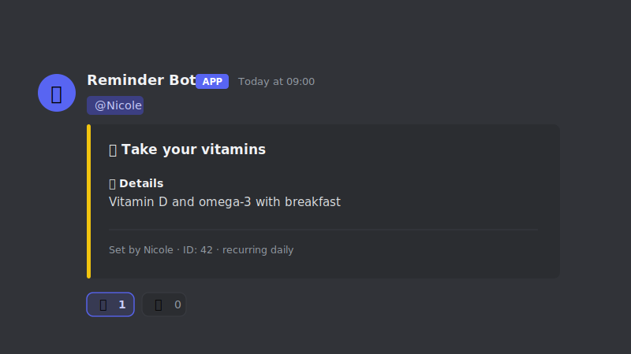

I have a habit of building things when I can't find exactly what I need. Some of these started in
the lab, others came from everyday frustrations, but they all solve problems I ran into myself.
LLMs helped write much of the code, while I designed each tool around how I actually wanted it to
work. They're grouped into research tools and everyday tools below.

[Research & data]{.eyebrow}

::::: {.card-grid}

:::: {.pcard}

::: {.pcard-body}
### [VISET](tools/viset/index.qmd){.stretched-link}
[Python library · open source]{.paper-meta}

A Python package for area-proportional Venn, Euler, and UpSet diagrams that prints the actual
member names inside each region, making set comparisons far easier to interpret.
:::

::::

:::::

[Lifestyle]{.eyebrow}

::::: {.card-grid}

:::: {.pcard .is-soon}

Coming soon

::: {.pcard-body}
### Focus Pocus
[Desktop app · Windows · in development]{.paper-meta}

A privacy-first focus timer that notices when you've drifted off, whether it's an idle mouse or a
site on your blocklist, and nudges you back before distractions take over.
:::

::::

:::: {.pcard}

::: {.pcard-body}
### [Reminder Bot](tools/reminder-bot/index.qmd){.stretched-link}
[Discord bot · runs locally]{.paper-meta}

A self-hosted Discord bot that turns reminders into a shared accountability system, complete with
scoreboards, weekly reports, and a healthy amount of roasting.
:::

::::

:::::
