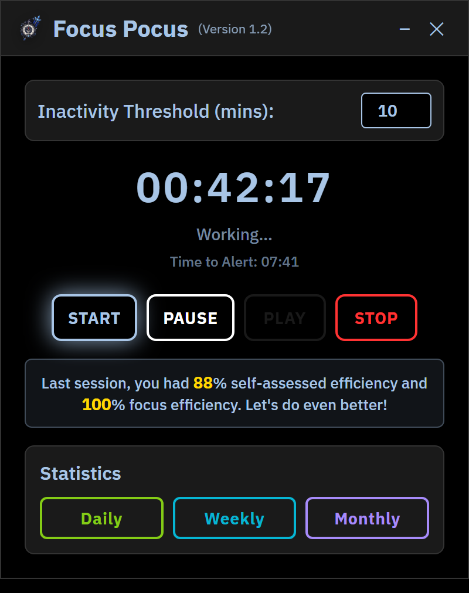
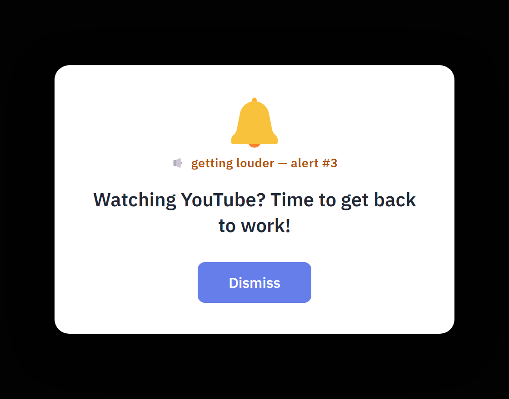
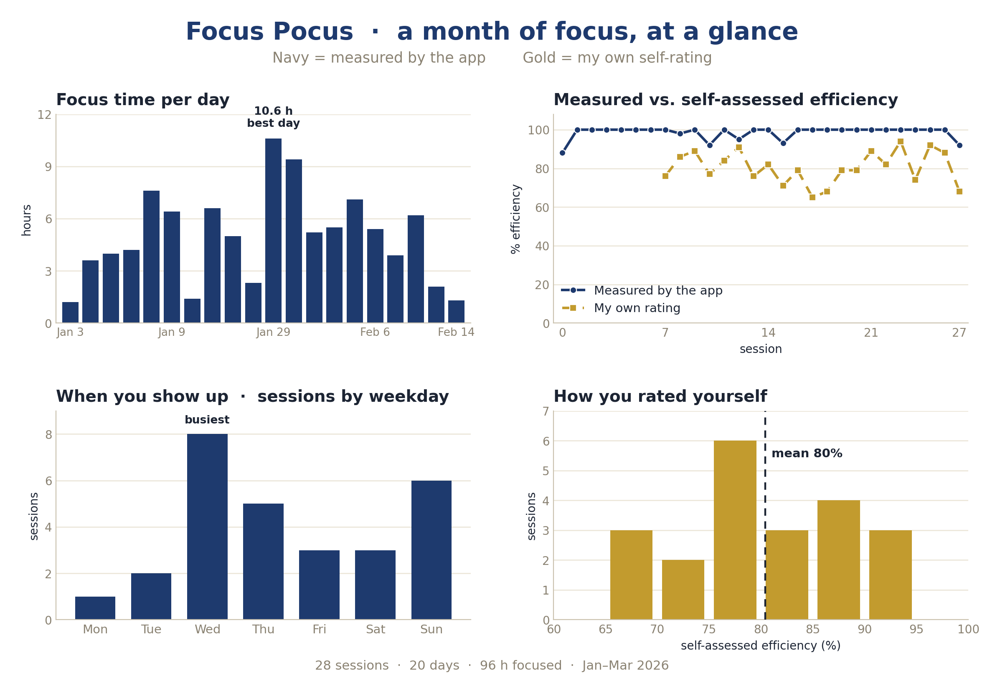

[← Back to tools](../../tools.qmd){.back-link}

[Desktop app · Electron · Windows · in development]{.paper-meta}

Writing a PhD thesis is a long exercise in accountability with no one watching. Mine ran to
280 pages, and getting there meant sitting down to write on days when every other tab looked
more appealing, the procrastination, the slow drift, the hour that vanishes before you notice.
I needed something that *would* watch, not to shame me, but to catch the moment I wandered and
pull me back before the hour was gone.

I looked at the focus apps already out there and didn't want them. Too many are built around
harvesting what you do, your habits, your schedule, your attention, and selling it on or holding
it on a server you don't control. I wasn't willing to trade my privacy for a timer. So I built my
own: **Focus Pocus**, a small desktop app that sits in the corner while you work, notices when you
have drifted, and nudges you back, and **keeps every scrap of your data on your own machine**.

There are plenty of focus tools built around the Pomodoro idea of fixed work-and-break blocks.
Focus Pocus keeps a timer, but the point of this one is *your own accountability*: instead of just
counting down, it pays attention to whether you are actually working, and it speaks up when you
are not.

{.paper-figure style="max-width:340px" fig-alt="The Focus Pocus timer window: a running 00:42:17 timer, Working status, START/PAUSE/PLAY/STOP controls, a last-session efficiency note, and Daily/Weekly/Monthly stats buttons"}

[The main window while you are working: a running timer, a countdown to the next nudge, and your
last session's efficiency.]{.fig-legend}

## The nudge, and the escalating beep

You set an *inactivity threshold*, say ten minutes. If your mouse and keyboard go quiet for
longer than that, or if a known time-sink takes over your screen, Focus Pocus pops up and beeps.
Ignore it and it does not give up. Each unanswered nudge comes back *louder*, with more beeps
than the last, until you deal with it. Gentle at first, hard to tune out by the third.

{.paper-figure style="max-width:560px" fig-alt="A Focus Pocus alert card with a bell icon reading 'Watching YouTube? Time to get back to work!' and a Dismiss button"}

[What it looks like when you are *not* studying. Drift onto YouTube or start scrolling (say,
TikTok or a manga reader) and it calls you out.]{.fig-legend}

## Bring your own distractions

Everyone's rabbit hole is a different shape, so Focus Pocus lets you build your own blocklist. In
the settings you add whatever tends to pull you away, one at a time, by the name you would see on
its browser tab or in its title bar: `youtube`, `tiktok`, `netflix`, a comfort game, a manga
reader. From then on it watches for those words in whatever window is in front of you, and speaks
up when one of them lingers too long. Your list is kept in a plain file on your own machine and,
like everything else here, never leaves it.

A blocklist is a nudge, though, not a locked door. Nothing stops you closing the app, renaming a
tab, or talking yourself into a workaround, and Focus Pocus will not wrestle you over it. But if
you go hunting for the gap, the only person waiting on the other side is you. This was always meant
to be a mirror you hold up to your own focus rather than a cage, so how honestly you use it is, in
the end, entirely yours to decide.

## Your data never leaves your machine

This is the part I care about most. Focus Pocus is not watching your screen, and it never
records *what* you were looking at:

- **Idleness** comes from the operating system's idle timer, has the mouse or keyboard moved
  recently? That is a single number, read in the moment and never saved.
- **Distractions** are caught by reading the *title* of your active window (does it say
  "YouTube"?), never the contents of a page and never a screenshot, and that reading is checked in
  the moment and never saved either.
- **The tally** is the only thing kept, and it never leaves your machine. There is no account and
  no server, so the app has no way to send your data anywhere. Each session's *numbers* (how long
  you focused, how many times you were nudged, your own rating) are written to a plain file on your
  own computer; the window titles and pages themselves are never stored. It is an offline record
  that stays with you, never the cloud, never GitHub.

You get the accountability without the surveillance. I think everyone deserves that: to be the one
in charge of their own data.

## What it tells you afterwards

Each session logs how long you focused, how long you paused, how many times you got nudged, and
a self-rating of how the session felt. Over a month that adds up to a picture of when and how you
actually work, including the honest gap between how efficient you *felt* and how efficient you
*were*.

{.paper-figure style="max-width:900px" fig-alt="A four-panel Focus Pocus statistics dashboard: focus time per day, measured vs. self-assessed efficiency over time, sessions by weekday, and a histogram of self-ratings"}

[Two months of my own real sessions, 35 of them between January and March 2026. Throughout, navy is what
the app measured and gold is how I rated myself. My measured focus efficiency runs high (98%
on average) while my own rating sits lower (82%), so it turns out I under-rate myself.]{.fig-legend}

## Still building

Focus Pocus is a work in progress. Right now it works from two low-level signals: whether your
mouse and keyboard have moved, and the title of the window in front of you. I am expanding the
list of distraction sites it recognises, cleaning up the session data, and turning these charts
into a proper in-app dashboard.

Adding your own distractions is now built in. The gap still left is the rare site that gives its
name away nowhere, not even in its tab, so there is no word to catch it by; handling those cleanly
is the next thing I want to solve.

## The catch: it can't focus for you

Focus Pocus is a nudge, not a cure-all. No app can do the hard part for you, at the end of the day
the accountability has to be yours. The timer can catch you drifting and call you back, but sitting
down and doing the work is still on you. What it gave me was a little more honesty about where my
hours actually went, and a louder conscience when I wandered. The thesis still had to be written
one page at a time.

Focus Pocus was designed, built, and iterated with large language models as a coding partner.

[Requirements: Windows · Node.js (to run from source)]{.paper-meta}

[View the code on GitHub →](https://github.com/mnicolee/Focus-Pocus){.read-more}

[]{.section-rule}
