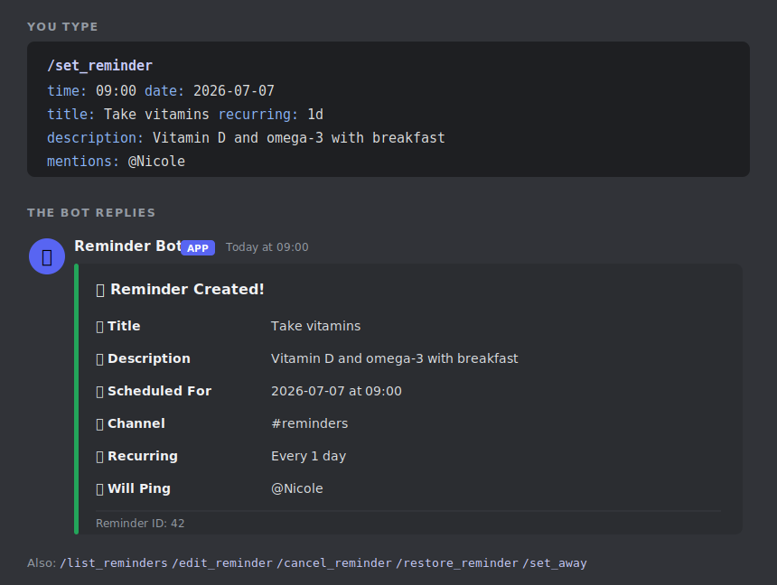
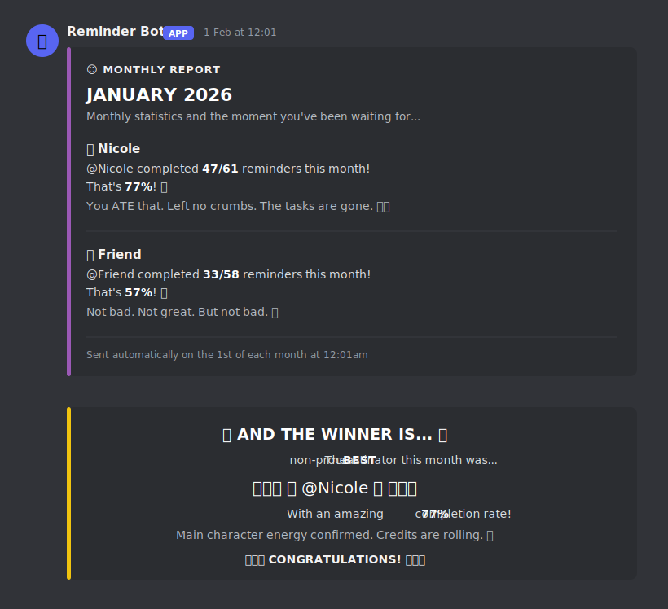

[← Back to tools](../../tools.qmd){.back-link}

[Discord bot · Python · runs locally]{.paper-meta}

Procrastination and ADHD are things my friends and I have always struggled with, and somewhere
along the way it stopped feeling like a personal failing and started looking like the norm. The
research agrees. Steel's meta-analysis of the procrastination literature estimates that
[80 to 95 percent of college students procrastinate](https://psycnet.apa.org/record/2006-23058-004),
and that almost half do it consistently and problematically. ADHD is not fringe either: a
[global review](https://jogh.org/the-prevalence-of-adult-attention-deficit-hyperactivity-disorder-a-global-systematic-review-and-meta-analysis/)
puts symptomatic ADHD at roughly 6.8 percent of adults worldwide, hundreds of millions of people.
Reading that was oddly reassuring. We were not uniquely broken, just part of a very large club.

What I wanted was accountability. I took a lot of my inspiration from
[Habitica](https://habitica.com/), which turns your habits and to-dos into a role-playing game,
with experience points, streaks, and a party of friends. It genuinely worked, for a while. But it
faded for the reason these tools usually do: nothing stopped us from simply not opening it. The
moment your accountability lives in an app you can close and ignore, you close and ignore it.

So I wanted to move the nagging somewhere I could not dodge, into a place I already had open all
day. For a student, that place is Discord. So I built **Reminder Bot**, a Discord bot you host
yourself, that pings you and your friends on your own schedule, keeps a scoreboard of who actually
followed through, and keeps every scrap of its data on your own machine. The nagging turns into
less of a chore and more of a running joke between friends.

{.paper-figure style="max-width:640px" fig-alt="A Discord message from Reminder Bot: it pings @Nicole with a gold reminder embed titled 'Take your vitamins', a Details field, a footer reading 'Set by Nicole, ID 42, recurring daily', and checkmark and cross reactions below"}

[What a reminder looks like when it fires. It pings the people you tagged, and you tap ✅ when it is
done or ❌ if you are skipping it.]{.fig-legend}

## A reminder that actually pings you

You give a reminder a time, a date, a title, and a short description, and when the moment comes the
bot posts it in your channel and pings whoever you tagged. Every reminder can:

- **Recur** on whatever rhythm you want: every day, every week, every few hours, or on specific
  weekdays like Monday, Wednesday, Friday.
- **Fire several times a day.** Set two or three times for the same reminder and tap ✅ on any one
  of them to skip the rest of that day. Handy for medication or water.
- **Tag specific people** so the right person gets the ping, in the right channel.
- **Respect an away schedule.** Going on holiday? Set yourself away for a stretch and the bot quietly
  holds your pings and leaves them out of your score, so a week off does not read as a week of failure.

Two reactions sit on every reminder. Tap ✅ and it counts as done. Tap ❌, or ignore it entirely, and
it counts as a miss. That single tap is the whole scoring system, and it is what the reports below
are built on.

## Setting one up

Everything runs through Discord slash commands, so you get the built-in autocomplete as you type.
One command sets a reminder, and the rest let you look after the ones you already have.

{.paper-figure style="max-width:660px" fig-alt="Two panels. The top, labelled 'You type', is a code block of the /set_reminder command with time, date, title, recurring, description and mentions fields. The bottom, labelled 'The bot replies', is a green Discord embed titled 'Reminder Created!' listing Title, Description, Scheduled For, Channel, Recurring and Will Ping, plus a row of other slash commands"}

[Setting a reminder, and the confirmation the bot sends back. `/list_reminders`, `/edit_reminder`,
`/cancel_reminder` and `/restore_reminder` handle the rest, with a seven day grace period so a
cancelled reminder can be brought back.]{.fig-legend}

## The part I actually love: the reports

The tap-to-complete scoring quietly adds up in the background, and once a week and once a month the
bot turns it into a report. This is the bit that keeps me honest. Your score is simply the reminders
you ticked off divided by the reminders you were sent, and a multi-time reminder counts once for the
day rather than punishing you per ping.

**Every Monday morning** it posts the week just gone: a completion rate for each person, and a line
of commentary pitched to how you did.

{.paper-figure style="max-width:640px" fig-alt="A gold Discord embed titled 'Weekly Report, Week of 12 to 18 Jan 2026'. It lists Nicole at 9 of 13 reminders (69%) with the remark 'You showed up AND stayed? Character development.' and Friend at 4 of 16 (25%) with 'You speedran doing nothing. Impressive, honestly.'"}

[The weekly report. Do well and it cheers you on. Slack off and it drags you, gently.]{.fig-legend}

**On the first of every month** it posts the bigger picture, and then it crowns a winner: the best
non-procrastinator of the month, with a fittingly over-the-top celebration.

{.paper-figure style="max-width:620px" fig-alt="A purple Discord embed titled 'Monthly Report, January 2026' showing Nicole at 47 of 61 (77%) with 'You ATE that. Left no crumbs.' and Friend at 33 of 58 (57%) with 'Not bad. Not great. But not bad.', followed by a gold winner embed crowning @Nicole with confetti and party emoji"}

[The monthly report and the winner announcement. There are hundreds of these lines, drawn from four
tiers depending on your completion rate, so the roasts and the praise rarely repeat.]{.fig-legend}

The commentary is the whole personality of the thing. A rough week gets *"The bar was on the floor
and you brought a shovel."* A good one gets *"Main character energy confirmed. Credits are rolling."*
It is silly on purpose, because a scoreboard between friends should be fun to lose as well as to win.

## It runs on your machine, and stays there

Like everything I build, this one keeps to itself. Reminder Bot is not a service you sign up for. You
run it on your own computer with your own bot token, and it talks to Discord and nowhere else:

- **There is no external server and no account.** The bot has nowhere to phone home to, so your
  reminders and your scores cannot be sent anywhere.
- **Everything lives in plain files next to the bot.** Your reminders, your stats, your away
  schedules: all of it sits in small local files on your own machine, never in the cloud and never
  on someone else's database.
- **It is yours to read and to delete.** Because the data is just files on your disk, you can open
  them, back them up, or wipe them whenever you like.

To keep it running I point Windows at a small startup script that pulls any updates, checks its
dependencies, and launches the bot. Drop a shortcut to that script in your Startup folder and the
bot comes back online every time your computer does, quietly, in the background.

## Coming soon

Reminder Bot works, and it has been running in my own server for months, but it is not something I
can hand over just yet. Right now it is wired to my personal Discord bot token and my own local
storage, so the version on my machine is, in a real sense, private to me.

What I am working on now is generalising the code, and once that is done and tidy, I will make it
public. For now, consider this a preview of what is coming.

Built with an LLM as a coding partner.

[Requirements: a Discord account and bot token · Python 3.8+ · Windows, macOS or Linux]{.paper-meta}

[Public release coming soon]{.read-more}

[]{.section-rule}
