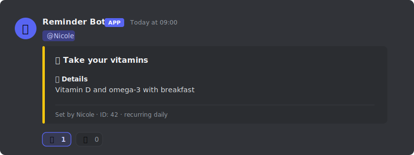
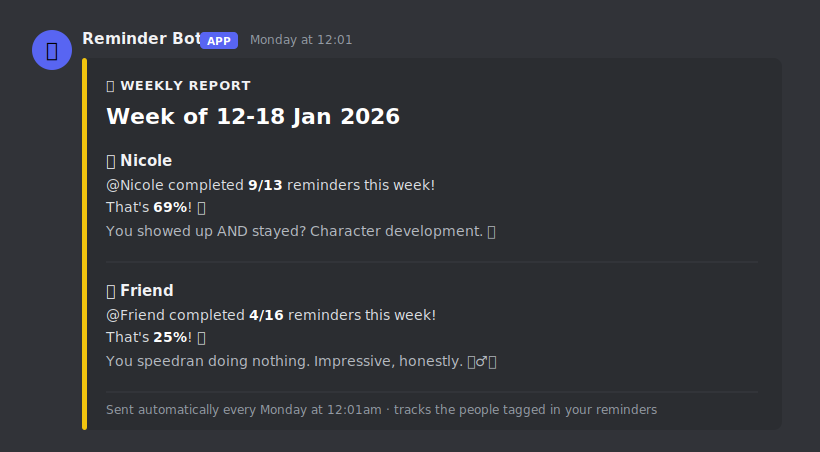

[← Back to tools](../../tools.qmd){.back-link}

[Discord bot · Python · runs locally]{.paper-meta}

Procrastination and ADHD are things my friends and I have always struggled with, and the research says we are not uniquely broken, just part of a very large club: Steel's meta-analysis estimates that [80 to 95 percent of college students procrastinate](https://psycnet.apa.org/record/2006-23058-004), and a [global review](https://jogh.org/the-prevalence-of-adult-attention-deficit-hyperactivity-disorder-a-global-systematic-review-and-meta-analysis/) puts symptomatic ADHD at roughly 6.8 percent of adults. What I wanted was accountability I could not dodge, so I moved the nagging into the one place I already have open all day: Discord. **Reminder Bot** is a Discord bot you host yourself that pings you and your friends on your own schedule, keeps a scoreboard of who followed through, and keeps every scrap of its data on your own machine.

{.paper-figure style="max-width:760px" fig-alt="A Discord message from Reminder Bot: it pings @Nicole with a gold reminder embed titled 'Take your vitamins', a Details field, a footer reading 'Set by Nicole, ID 42, recurring daily', and checkmark and cross reactions below"}

[What a reminder looks like when it fires. It pings the people you tagged, and you tap ✅ when it is
done or ❌ if you are skipping it.]{.fig-legend style="max-width:760px"}

## A reminder that actually pings you

Give a reminder a time, a title, and the people to tag, and when the moment comes the bot posts it in your channel and pings them. Every reminder can **recur** on whatever rhythm you want (daily, weekly, or specific weekdays), **fire several times a day** so ticking any one skips the rest (handy for medication or water), and **respect an away schedule** so a holiday holds your pings and does not read as a week of failure. Two reactions sit on every reminder: tap ✅ and it counts as done, tap ❌ or ignore it and it counts as a miss. That single tap is the whole scoring system.

## The part I actually love: the reports

The tap-to-complete scoring quietly adds up, and once a week and once a month the bot turns it into a report. Your score is simply the reminders you ticked off divided by the ones you were sent, and each person gets a line of commentary pitched to how they did.

{.paper-figure style="max-width:760px" fig-alt="A gold Discord embed titled 'Weekly Report, Week of 12 to 18 Jan 2026'. It lists Nicole at 9 of 13 reminders (69%) with the remark 'You showed up AND stayed? Character development.' and Friend at 4 of 16 (25%) with 'You speedran doing nothing. Impressive, honestly.'"}

[The weekly report. Do well and it cheers you on. Slack off and it drags you, gently.]{.fig-legend style="max-width:760px"}

The commentary is the whole personality of the thing. A rough week gets *"The bar was on the floor and you brought a shovel."* There are hundreds of these lines across four tiers, so the roasts and the praise rarely repeat, and the monthly report even crowns a winner. It is silly on purpose, because a scoreboard between friends should be fun to lose as well as to win.

## It runs on your machine, and stays there

Like everything I build, this one keeps to itself. There is no external server and no account: you run it on your own computer with your own bot token, and your reminders, stats, and away schedules all live in plain files next to the bot, yours to read, back up, or wipe.

## Coming soon

Reminder Bot works, and it has been running in my own server for months, but it is still wired to my personal bot token and local storage. Once I have generalised the code and tidied it up, I will make it public. For now, consider this a preview of what is coming.

Built with an LLM as a coding partner.

[Requirements: a Discord account and bot token · Python 3.8+ · Windows, macOS or Linux]{.paper-meta}

[Public release coming soon]{.read-more}

[]{.section-rule}
