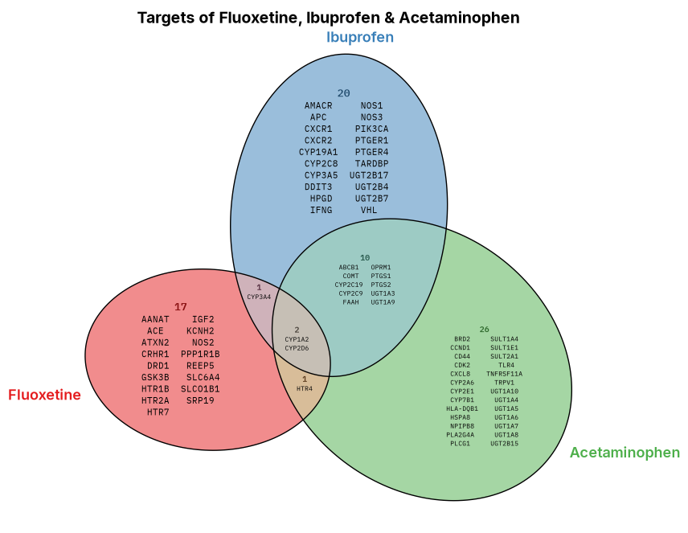
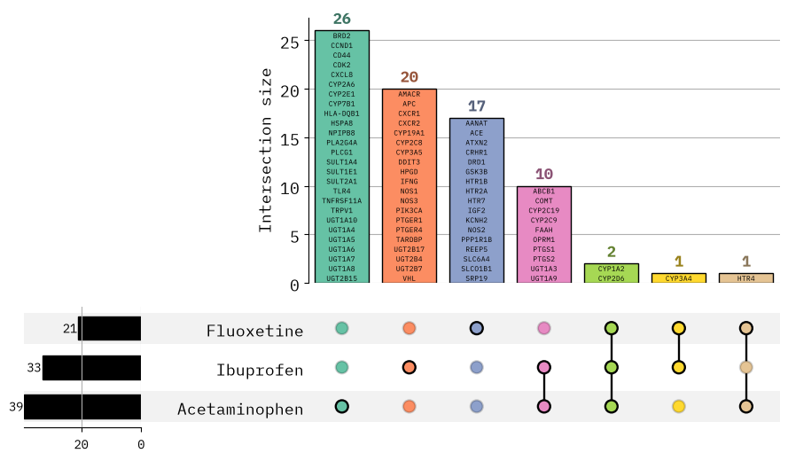

[← Back to tools](../../tools.qmd){.back-link}

[Python library · open source]{.paper-meta}

**VISET** stands for **Vis**ual **I**temized **SET** diagrams. It draws area-proportional Venn,
Euler, and UpSet plots that print the actual member names inside each region, in Python.

Set diagrams almost always label a region with a single count, how many items overlap, but not
*which* ones. The shapes are rarely drawn to scale either, so a small overlap and a large one can
end up looking the same. That throws away most of the information a set comparison is meant to
carry.

VISET fixes both problems. It sizes every region in proportion to how many members it holds,
prints each member name inside its region, and auto-sizes the labels so they stay legible even
when a region is crowded. It does this for both Venn/Euler diagrams and UpSet plots, and every
plot has an interactive Plotly version that reveals crowded regions on hover.

{.paper-figure style="max-width:560px" fig-alt="A VISET area-proportional Venn diagram of the drug-target genes for Fluoxetine, Ibuprofen and Acetaminophen, with every gene name printed inside its region"}

[Three drug-target gene sets drawn with VISET. The ellipses are sized to scale and every gene is
printed inside the region it belongs to, so you can read the overlaps directly.]{.fig-legend}

Because a region can get dense, every VISET plot also has an interactive version. Hover any
region in the diagram below to read its members.

```{=html}
<iframe src="venn-interactive.html" title="Interactive VISET Venn diagram of drug-target genes" loading="lazy" style="display:block; width:100%; max-width:520px; height:460px; margin:1.4rem auto; border:1px solid #DAD3C4; border-radius:8px; background:#fff"></iframe>
```

The same comparison works as an UpSet plot when there are too many sets for a readable Venn. Each
intersection bar lists the genes it contains, so the itemized idea carries over.

{.paper-figure style="max-width:640px" fig-alt="A VISET UpSet plot of the same drug-target gene sets, with the genes in each intersection printed inside the corresponding bar"}

[The UpSet view of the same data. Each bar is an intersection, labelled with the genes inside
it.]{.fig-legend}

UpSet plots have an interactive version too, with the same hover-to-read behaviour as the Venn
above.

The code and full documentation live on [GitHub](https://github.com/mnicolee/VISET).

[]{.section-rule}
